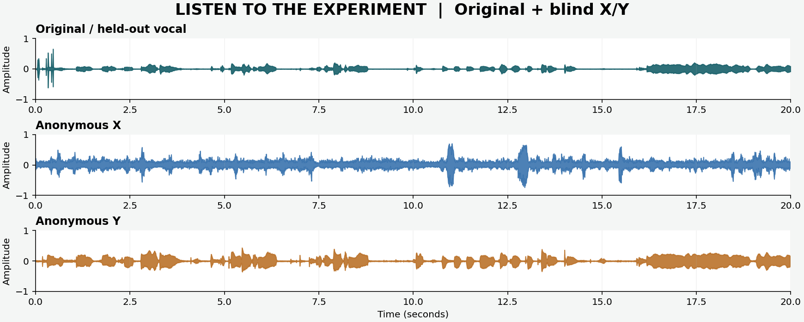

# 从零到 0.1B：可复现的语言模型实验课

**新增 Adele 来源参考探索：** 已自行取得 4 段实际访谈/短清唱候选，完成本人同一清唱的 5 次真实 CPU 模型推理。[▶ 原声和五条 AI 小样](https://djdeborah.github.io/sideproject/adele-exploration/) · [来源、操作与实测报告](https://github.com/DJDeborah/sideproject/blob/main/ai-fundamental/voice_lab/voice_workbench/ADELE_REFERENCE_REPORT.md)。原采访/字幕仅留本机；AI 输出尚未通过音质及 Adele 相似度验收，没有新训练。


**2026-10-03：声音质量反馈与新底座探索。** 原X/Y尚未通过音质验收（X噪声、Y多声部感），现已完成代码/波形审计。新增 [六条研究试听小样](https://djdeborah.github.io/sideproject/next-voice/)、[可录音的本机工作台](https://github.com/DJDeborah/sideproject/tree/main/ai-fundamental/voice_lab/voice_workbench) 与 [深度拆解报告](https://github.com/DJDeborah/sideproject/blob/main/ai-fundamental/voice_lab/VOICE_NEXT_EXPERIMENT.md)。小样是OpenVoice预训练CPU推理，参考Linda Johnson，**不是Adele**；中间参数和轻唱质量仍待试听验收。旧RVC的FP32指训练，旧导出/推理为FP16。


**[▶ 在线播放：原声 / 匿名 X / 匿名 Y / A / B](https://DJDeborah.github.io/sideproject/)** · [项目亮点与图表](../README.md) · [模型下载](https://github.com/DJDeborah/sideproject/releases/tag/ai-fundamental-2026-10-03)

[](https://DJDeborah.github.io/sideproject/)

实际完成：100.68M Transformer 三种子实验、Triton 前向基准、局部 scaling 留出检验；本人清唱 RVC A/B 各 1000 次真实更新。后训练与 Agent 的正式能力对照尚未完成，详见报告。


**新增：本人清唱 A/B 实验已完成。** [在线试听](https://DJDeborah.github.io/sideproject/) · [声音实测报告](voice_lab/runs/new4090d_ab_retry1/MEASURED_REPORT.md) · [术语与操作教程](voice_lab/RVC_STEP_BY_STEP.md) · [模型和完整项目下载](DOWNLOADS.md)


歌声音色转换的新增学习路线在 [`voice_lab/README.md`](voice_lab/README.md)：本人录音准备、单卡 DDSP-SVC 转换模块训练、Jupyter 音频试听、双音色比例扫描及实验报告。首次云端上传包为 `dist/voice_lab_autodl_starter.zip`，与下面的语言模型实验分别记录。

**0.1B 语言模型研究的最终交付：** [`report/FINAL_REPORT.md`](report/FINAL_REPORT.md) 与 [`PDF`](output/pdf/0.1B_transformer_final_report.pdf) 汇总全部实测图表、统计分析、失败探针、术语和复核路径。旧的自动跟进已停止，原过程记录 [`report/neurips_style.md`](report/neurips_style.md) 作为归档保留。

这个仓库按依赖顺序拆成八站。每站先跑 `--help`，阅读对应源码，再跑小规模实验。`tiny` 配置只检查代码路径；`base100m` 是约 1.01 亿参数的目标配置。**没有 GPU 实测数据时，不把示例数值写成结果。**

**纯新手请先读 [`BEGINNER_TUTORIAL.md`](BEGINNER_TUTORIAL.md)：**术语全称、每一步的入口/输入/输出/预期结果、终端聊天体验、CUDA 跳过原因和租卡流程都在那里。

首次租 AutoDL 单卡可直接上传 `dist/ai_fundamental_autodl_starter.zip`，解压后先读 `AUTODL_START_HERE.md`。这个 ZIP 可用 `python scripts/make_autodl_bundle.py` 重新生成；包含源码、教程、示例文本、tokenizer 和两个玩具 checkpoint，不包含 `.venv` 或尚未训练的 0.1B 模型。

FineWeb-Edu 真实文本试点另有 `dist/fineweb_edu_pilot.zip`；云端无法直连 Hugging Face 时上传这个小包，按 [`DATA_PILOT_README.md`](DATA_PILOT_README.md) 验证 SHA-256 并清洗。该包仅有 1000 篇文本，不用于正式 0.1B 训练。

## 环境

Python 3.10+；PyTorch 2.4+；NumPy、pytest。NVIDIA GPU 上的 Triton 实验建议在 Linux/WSL2 的 CUDA 环境安装 `triton`，并按 [官方兼容性说明](https://github.com/triton-lang/triton#compatibility)核对硬件。Windows 原生环境先做 CPU 逻辑实验。

```bash
python -m venv .venv
# Windows: .venv\Scripts\activate ；Linux: source .venv/bin/activate
pip install -r requirements.txt
python -m pytest -q
```

本机实测环境是 Windows、i7-6700、16 GB RAM、Intel HD Graphics 530，没有 CUDA。其 Anaconda 的系统级 `torch` 已损坏；在本项目虚拟环境中安装最新 CPU wheel 时出现 `c10.dll` 加载错误，换用 `torch==2.4.1+cpu` 可以正常运行。若你在同一台电脑复现，先在虚拟环境执行：

```powershell
.\.venv\Scripts\python.exe -m pip install torch==2.4.1+cpu --index-url https://download.pytorch.org/whl/cpu
.\.venv\Scripts\python.exe -m pip install -r requirements.txt
.\.venv\Scripts\python.exe -m pytest -q
```

租赁 GPU 环境通常带 CUDA PyTorch；在那里按供应商镜像核对版本，然后另装 Triton。

## 课程地图

| 站 | 代码 | 要回答的问题 | 产物 |
|---|---|---|---|
| 0 语料 | `fundamental/data.py` | 原始文本如何清洗、去重、分割，怎样避免泄漏？ | `clean/{train,val,test}.jsonl` 和 manifest |
| 1 Tokenizer | `fundamental/tokenizer.py` | byte-level BPE 如何训练、编码、解码？ | `tokenizer.json` |
| 2 Transformer | `fundamental/model.py` | RoPE、RMSNorm、SwiGLU、因果注意力如何组合？ | 参数量与前向/反向检查 |
| 3 预训练 | `fundamental/train.py` | 如何记录 token budget、验证损失、checkpoint？ | `base.pt` 和 JSONL 日志 |
| 4 kernel/多卡 | `fundamental/triton_attention.py`, `fundamental/bench.py` | 手写 forward kernel 对照 SDPA；DDP 的训练/推理吞吐是否真的改善？ | 基准 JSONL |
| 5 scaling | `fundamental/scaling.py` | 固定数据分布下损失如何随 N、D 变化？外推不确定性多大？ | 拟合参数与留出误差 |
| 6 后训练 | `fundamental/posttrain.py` | 同一 base 上 SFT、DPO、RLVR 的受控对照 | 三条分支 checkpoint |
| 7 Agent | `fundamental/agent.py`, `fundamental/env.py` | 可验证环境、harness、长程信用分配和 self-judge 怎样评估？ | 轨迹与成功率 |

## 快速冒烟实验

准备自己的合法语料。JSONL 每行至少有 `text`, `source`, `license`，或用 `.txt` 加 `--text-license`。示例生成器只用于跑通管线，**不能用来声称模型学到了语言**。

```bash
python -m fundamental.demo_data --out raw/demo.jsonl
python -m fundamental.data --input raw/demo.jsonl --out clean --licenses CC0
python -m fundamental.tokenizer train --input clean/train.jsonl --out tokenizer.json --vocab-size 512
python -m fundamental.tokenizer pack --tokenizer tokenizer.json --input-dir clean --out tokens
python -m fundamental.model --config tiny --vocab-size 512
python -m fundamental.train --data tokens --tokenizer tokenizer.json --config tiny --steps 20 --out runs/tiny
python -m fundamental.posttrain make-data --out tasks
python -m fundamental.posttrain sft --base runs/tiny/base.pt --data tasks/sft.jsonl --tokenizer tokenizer.json --out runs/sft.pt --steps 10
python -m fundamental.posttrain dpo --base runs/sft.pt --data tasks/dpo.jsonl --tokenizer tokenizer.json --out runs/dpo.pt --steps 10
python -m fundamental.posttrain rlvr --base runs/sft.pt --data tasks/rlvr.jsonl --tokenizer tokenizer.json --out runs/rlvr.pt --steps 10
python -m fundamental.evaluate --checkpoints runs/tiny/base.pt runs/sft.pt runs/dpo.pt runs/rlvr.pt --tokenizer tokenizer.json --data tasks/eval.jsonl --out runs/posttrain_eval.json
python -m fundamental.agent collect --out tasks/agent_oracle.jsonl --episodes 100 --horizon 4
python -m fundamental.agent train --base runs/tiny/base.pt --tokenizer tokenizer.json --data tasks/agent_oracle.jsonl --steps 50 --out runs/agent_imitation.pt
python -m fundamental.agent eval --base runs/agent_imitation.pt --tokenizer tokenizer.json --episodes 10 --horizon 4 --out runs/agent_eval.jsonl
```

完整 0.1B 实验（`base100m`，需要自行准备规模足够的数据和 GPU）：

```bash
python -m fundamental.tokenizer train --input clean/train.jsonl --out tokenizer.json --vocab-size 8192 --max-bytes 20000000
python -m fundamental.tokenizer pack --tokenizer tokenizer.json --input-dir clean --out tokens
torchrun --standalone --nproc_per_node=4 -m fundamental.train --data tokens --tokenizer tokenizer.json --config base100m --steps 16000 --global-tokens 131072 --eval-every 200 --save-every 200 --out runs/base100m
```

`--global-tokens` 必须能被 `world_size * batch_size * seq_len` 整除。多卡是数据并行，模型仍需放进每张卡；按显存调 `batch_size`/`seq_len`。跑完从 `runs/base100m/metrics.jsonl` 读取实际 token、loss、吞吐与耗时。推理对照需要使用**同一 checkpoint 和 prompt**；多个请求并行能提高 aggregate throughput，单请求延迟不一定下降。

长跑会周期保存 `runs/base100m/latest.pt`（含优化器和采样器状态）。中断后在**同样的 GPU 数、batch、seq、tokenizer 和输出目录**运行原命令并加 `--resume runs/base100m/latest.pt`；`--steps` 仍是总目标步数。最终 `base.pt` 供后训练/推理使用。本机验证：1 步保存后恢复至 2 步，与不中断训练 2 步的参数最大差异为 0。

```bash
python -m fundamental.bench attention --seq-len 512 --out runs/attention.jsonl
python -m fundamental.bench inference --base runs/base100m/base.pt --tokenizer tokenizer.json --out runs/infer_1gpu.jsonl
torchrun --standalone --nproc_per_node=4 -m fundamental.bench inference --base runs/base100m/base.pt --tokenizer tokenizer.json --out runs/infer_4gpu.jsonl
python -m fundamental.compare --kind inference --single runs/infer_1gpu.jsonl --multi runs/infer_4gpu.jsonl --out runs/infer_speedup.json
python -m fundamental.scaling --input runs/small/metrics.jsonl runs/medium/metrics.jsonl runs/base100m/metrics.jsonl --target-params 200000000 --target-tokens 1000000000 --out runs/scaling.json
python -m fundamental.agent rl --base runs/agent_imitation.pt --tokenizer tokenizer.json --episodes 100 --horizon 8 --out runs/agent_rl.pt
python -m fundamental.agent eval --base runs/agent_rl.pt --tokenizer tokenizer.json --episodes 100 --horizon 8 --self-judge --out runs/agent_selfjudge_eval.jsonl
```

Scaling 命令只是接口示意：三个 metrics 文件必须各自覆盖多个 token budget，合计至少八个不同 `(N,D)` 点。`agent rl` 是用 verifier 回报训练的简化在线 policy gradient，建议先跑 imitation，再比较自评开启/关闭的同一批 held-out seeds。

多卡训练对照：在**同一台租赁机**上先设置 `CUDA_VISIBLE_DEVICES=0` 跑 `python -m fundamental.train ... --global-tokens 131072 --seq-len 1024 --seed 42 --out runs/train_1gpu`，再用四卡的 `torchrun ... --global-tokens 131072 --seq-len 1024 --seed 42 --out runs/train_4gpu`。两次使用相同的 `--steps`、语料与 tokenizer；再运行 `python -m fundamental.compare --kind train --single runs/train_1gpu/metrics.jsonl --multi runs/train_4gpu/metrics.jsonl --out runs/train_speedup.json`。缩放拟合则另跑 `small/medium/base100m` × 三个 token budget，保持 `--seq-len` 一致。

**已验证（本机 CPU，2026-10-02）：** `pytest` 18 项通过、1 项 CUDA 测试跳过；demo 清洗得到 train/val/test 为 1467/18/15 文档；tiny 训练、SFT/DPO/RLVR 和 Agent 接口均完成短跑。`runs/chat_toy.pt` 用 4 条玩具对话训练 200 步，可用 `python -m fundamental.chat --checkpoint runs/chat_toy.pt --tokenizer tokenizer.json` 在终端体验；它不具备通用对话能力。**云端 RTX 4090 实测：** Triton attention 六组正确性测试通过；长度 1024、形状 `[2,12,1024,64]` 的交替 CUDA Event 测量前向速度比中位数 1.2936×，长度 2048、4096 慢于 SDPA。多卡性能未测量。**真实语料与 0.1B：** FineWeb-Edu 两个 Parquet 分片共 145.5 万篇，清洗、正式词表和全量 token 编码已完成；三模型三种子的 scaling grid 均跑完，最大模型 seed 42 续训至 500M 验证点后按用户新方向停止。正式后训练与 Agent 对照未运行。最终结论见 [`report/FINAL_REPORT.md`](report/FINAL_REPORT.md)。

## 研究纪律

- 语料许可证、来源、过滤比例、切分哈希要留档；tokenizer 只在 train split 拟合。
- scaling 至少用 3 个模型尺寸 × 3 个 token budget，固定验证集，留出最大规模做外推检查；单个 0.1B 点不能拟合 scaling law。
- 主对照以同一个预训练 base 为祖先：base→SFT，然后从**同一份 SFT checkpoint**分叉 DPO 与 RLVR。记录训练 token 数、采样数、算力和 eval seeds；可另加 base→DPO/RLVR 作为冷启动消融。RLVR 使用确定性 verifier；self-judge 的意见只作为诊断或候选生成，不能当成功真值。
- 报告草稿在 [`report/neurips_style.md`](report/neurips_style.md)。里面的空表需要真实实验填充。

## 参考资料

- [Triton Fused Attention 教程](https://triton-lang.org/main/getting-started/tutorials/06-fused-attention.html)
- [PyTorch 分布式总览](https://docs.pytorch.org/tutorials/beginner/dist_overview.html)
- [Chinchilla scaling](https://arxiv.org/abs/2203.15556)
- [DPO 原论文](https://arxiv.org/abs/2305.18290)
- [DeepSeekMath / GRPO](https://arxiv.org/abs/2402.03300)
- [NeurIPS reproducibility checklist](https://neurips.cc/Conferences/2021/PaperInformation/PaperChecklist)
