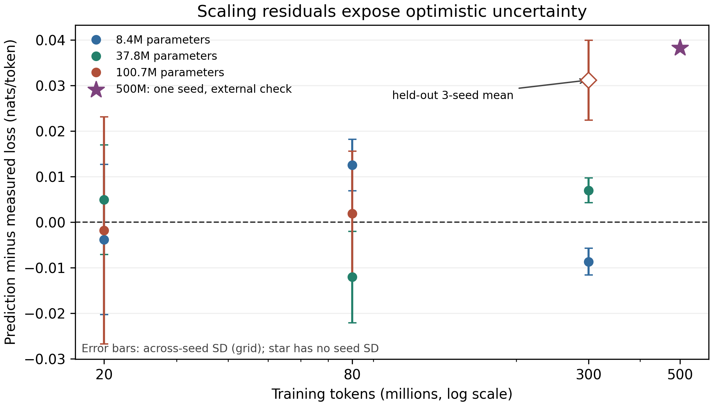
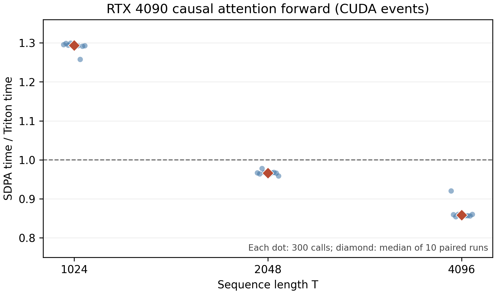

# 从原始文本到 0.1B Transformer：一项可复核的单卡研究与失败模式分析

**A Reproducible Single-GPU Study of a From-Scratch 0.1B Transformer**  
**最终报告，2026-10-02 · NeurIPS 风格研究稿（教学与实测记录，不声称会议录用或完整的通用能力）**

## 摘要

我们从公开英文网页文本建立了清洗、分割、byte-level BPE 分词、decoder-only Transformer、单卡预训练、注意力内核基准、局部 scaling 拟合和可验证任务探针的一条证据链。正式语料来自 FineWeb-Edu 的两个 Parquet 分片，清洗后训练集包含 1,416,623 篇、2,685,790,665 个本项目 token。8.39M、37.76M、100.68M 参数模型各用三个种子，在约 20M、80M、300M token 处验证，得到九个规模格、27 条原始观测。预留的最大规模格实际验证损失为 **2.16986 ± 0.00877 nats/token**（均值 ± 三种子标准差），局部幂律预测为 **2.20104**，误差 **0.03118**，大于种子波动。相同 100.68M 模型的 seed 42 续训到约 500M token 后验证损失为 **2.11379**，进一步暴露该拟合的系统性偏差。RTX 4090 上自写 Triton 因果注意力在 `[2,12,1024,64]` 的 fp16 前向调用比 PyTorch SDPA 快 **1.2936×**（10 对交替 CUDA Event 测量的中位数），而在 T=2048、4096 分别只有 **0.9663×**、**0.8585×**。一个短训练基座上的 SFT、DPO、RLVR 与长程 Agent 探针没有学会所测任务：四个语言模型分支均为 0/50 道算术题，RLVR 全部 20 步因奖励方差为零而没有更新。2B token 续训在约 500M 已验证点之后因研究方向转向语音模型而停止；正式后训练、双卡和长程 Agent 对照未运行。本文同时给初学者逐段解释术语、接口和每一步应检查的产物，并对外推、计时与数据许可的结论边界给出可复核说明。

**关键词：** tokenizer；Transformer；scaling law；Triton；可验证奖励；可复现性。

## 1. 研究范围、结果判读与新手地图

问题是：在普通租赁单卡上，哪些“从零训练 0.1B”的结论能被真实日志支持？本工作得到两类可检验结果：**预训练的局部损失曲线**和**单一注意力前向形状的性能比较**。剩余模块有代码和短探针，但没有达到可以比较算法优劣的训练及统计强度。

| 环节 | 本次实际状态 | 能得出的结论 | 不能得出的结论 |
|---|---|---|---|
| 语料、清洗、BPE | 两个 FineWeb-Edu 分片；另做 WET 解析试点 | 固定切分、tokenizer 与二进制 token 流已生成 | 全网数据无污染或所有网页可再分发 |
| 0.1B 基座 | 100,679,424 参数；三种子各到 300M token；seed 42 另到 500M 验证点 | 同一词表下损失随 token 下降 | 能聊天、能做算术或达到 2B token |
| scaling law | 9 格/27 点；最大格预留；200 次配对轨迹 bootstrap | 此区间内局部拟合与外推检验 | 2B 损失已测得；区间覆盖模型形式偏差 |
| Triton | 数值检查与 RTX 4090 前向 A/B | T=1024 的指定形状快约 1.29× | 训练、反向或一般长度都加速 |
| SFT/DPO/RLVR | 仅短基座接口探针 | 暴露稀疏奖励冷启动失败 | 三算法孰优孰劣 |
| Agent/self-judge | 确定性环境与小样本失败探针 | harness 可运行；老探针 0/10 | 长程能力改善或自评有效 |
| 1 vs 2 GPU | 未运行 | 无 | 多卡吞吐增益 |

**新手先记住五个量。** `N` 是模型参数个数，相当于模型可调旋钮数；`D` 是训练时处理的 token 数，不一定是不同 token 数；`loss` 是对正确下一个 token 分配概率的平均负对数，越低通常越好；`seed` 是随机初始化和抽样的起点；`validation` 是训练时不参与参数更新、用于检查泛化的固定数据。这里的 token、loss 与别的分词器或数据集不能直接横比。

## 2. 方法：每一阶段的输入、接口与可观察输出

### 2.1 数据：从来源到固定切分

**输入**是 [FineWeb-Edu 数据卡](https://huggingface.co/datasets/HuggingFaceFW/fineweb-edu)对应的 `sample/10BT` 中两个官方 Parquet 分片，分别 726,000 与 729,000 行。这是已经抽取并筛选过的网页文本，**并非原始 HTML WARC**。另一个独立试点读取 [Common Crawl WET](https://commoncrawl.org/get-started) 的前 10,000 个 conversion 记录，展示较接近 raw dump 的格式解析，但未混入主训练语料。原因是 WET 访问条款不等于每个网页内容均获可再分发许可。

`fundamental/data.py` 的接口是 `text/source/license` JSONL → 规范化、长度过滤、精确/近似去重 → `train/val/test.jsonl` 与 manifest。文档经过清洗后按 SHA-256 哈希固定划分，近似 98/1/1。训练集 1,416,623 篇，验证集 14,396 篇，测试集 14,580 篇；清洗日志分别记录 7,769 篇完全重复和 1,632 篇近重复。编码后 train/val/test 分别有 **2,685,790,665 / 27,400,609 / 27,098,920** 个 token（见[清洗清单](data/cloud/fineweb_clean_manifest.json)与[token 清单](data/cloud/full_token_manifest.json)）。

**初学者如何检查：** 看到 manifest 的 `raw` 与三个 split 计数、去重计数，并核对 `tokens` 是否大于零。这里的哈希切分防止同一个规范化文档同时进入训练和验证，但启发式 SimHash 无法排除所有近似改写，也没有完成与外部评测集的污染审计。

### 2.2 分词：字节级 Byte-Pair Encoding（BPE）

Tokenizer 是“文字↔整数编号”的可逆接口。手写 **Byte-Pair Encoding（字节对编码，BPE）** 从 256 种字节开始，反复合并训练文本中常见的相邻片段；因此罕见英文或中文字符仍可拆成 UTF-8 字节表示。仅在 `train` 切分拟合 8,192 个词表项：按文档哈希排序，取 10,397 篇、约 50MB 正文。Tokenizer SHA-256 为 `104fbc43dfa88b2da61b7bbbef87d126a720eac12dfcef876dc23bcb2ad28e7a`。

接口：`fundamental.tokenizer train` 写 `tokenizer_8192.json`；`pack` 把三个切分写成 little-endian `uint16` 连续编号流。**可见结果**是往返编码 `decode(encode(s))=s`、三个 split 的 token 数，以及文件哈希。注意：8,192 词表改变了模型 embedding 参数和每句 token 数；不可拿 2,048 词表探针的 loss 与正式 run 直接比较。正式词表文件在[这里](data/cloud/tokenizer_8192.json)。

**算法细节。** 设相邻片段对 `(u,v)` 在当前训练文本中的频数为 `f(u,v)`。每轮取 `argmax f(u,v)` 并把该对合成一个新 token，直到词表达到上限；编码时按相同合并规则处理新文本。字节起点保证覆盖字符，但短词表会把长词拆成更多 token，增加序列计算量。学习这套合并规则时不读验证/测试文本，避免把评估文本的具体片段直接写进词表。

### 2.3 模型：Decoder-only Transformer 与下一个 token 目标

配置为隐藏宽度 `d=768`、10 层、12 个注意力头、前馈宽度 3,072、最大上下文 1,024；词表 8,192；实际参数 **100,679,424**。实现包含 Rotary Position Embedding（旋转位置编码，RoPE）、Root Mean Square Normalization（均方根归一化，RMSNorm）、SwiGLU 门控前馈层与因果注意力。**因果**表示位置 `t` 只能看见 `≤t` 的 token，避免训练时偷看下一个答案。[Transformer 原论文](https://arxiv.org/abs/1706.03762)给出注意力架构背景。

训练目标为

`L = -(1/M) Σ_t log pθ(x[t+1] | x[≤t])`。

单个注意力头先计算 `S = QKᵀ/√d_head`，把未来位置的 `S_ij` 设为负无穷，再输出 `softmax(S)V`；多个头拼接后经过线性投影。RoPE 在每一对 query/key 通道上按位置旋转，使相对位置影响它们的内积；RMSNorm 用 `x / √(mean(x²)+ε)` 控制层间尺度；SwiGLU 用一个门控分支调节另一个前馈分支。它们是架构选择，不可从本实验的单一配置推断每个部件各自带来的增益。

对新手：模型读入前面一串编号，为下一个编号给出一组概率；正确编号的概率越高，`L` 越低。单位 **nats/token** 来自自然对数。`exp(L)` 是该分词器下的困惑度，例如本实验 300M 最大模型三种子均值 `exp(2.16986)≈8.76`；这**不是**答题正确率，也不可跨分词器直接比较。

### 2.4 训练与验证协议

三种模型大小（8,391,936 / 37,757,440 / 100,679,424 参数）各用随机种子 42/43/44。每步 8 条、每条 1,024 token，因此全局 batch 为 8,192 token；分别在第 2,441、9,766、36,621 步，即约 20M、80M、300M token 处验证。每次验证使用相同种子和 `32 × 8 × 1,024 = 262,144` 个抽样 token。训练用 PyTorch 自带 Scaled Dot-Product Attention（缩放点积注意力，SDPA），**没有把自写 Triton 前向核接进反向训练**。环境为 AutoDL RTX 4090（24,564 MiB），PyTorch 2.8.0+cu128，CUDA runtime 12.8，Triton 3.4.0。

训练接口是 `fundamental.train`，输入 `.bin` token 流、词表、模型配置和种子；输出 `metrics.jsonl`、用于推理的 `base.pt` 与含优化器状态的 `latest.pt`。`metrics.jsonl` 每行含 `step/tokens_seen/val_loss/train_tokens_per_s`。**看到了 loss 下降，才说明此验证协议下有学习；不能只看 GPU 利用率。** 最终九条运行均以返回码 0 完成，详见[运行清单](data/cloud/scaling_grid_v2_manifest_final.json)。

## 3. 实验一：规模与数据量

### 3.1 完整观测

下表每格是**三个独立种子的验证交叉熵均值 ± 样本标准差**，单位 nats/token；原始 27 条记录在 `report/data/cloud/scaling_*_metrics.jsonl`，不能把三次验证点误认为三个独立训练运行。

| 参数量 N | 20M token | 80M token | 300M token |
|---:|---:|---:|---:|
| 8.39M | 3.17962 ± 0.01650 | 2.59900 ± 0.00566 | 2.39005 ± 0.00294 |
| 37.76M | 3.03253 ± 0.01200 | 2.48521 ± 0.01005 | 2.23606 ± 0.00270 |
| 100.68M | 2.99728 ± 0.02490 | 2.42925 ± 0.01366 | **2.16986 ± 0.00877** |

在固定规模内，增加训练 token 后损失下降；在固定 token 数下，较大模型通常较低。最大模型从 20M 到 300M 的损失降低 **0.82742**。但是这些点都在同一语料、同一小词表与同一训练 recipe 下，属于**局部缩放现象**，不足以给“最优模型大小”下普遍结论。[Hoffmann 等人的 compute-optimal 研究](https://arxiv.org/abs/2203.15556)跨越更宽的模型和 token 尺度，本研究不能直接验证其计算最优法则。


*图 1. 实心点为测量值；黑色空圈为拟合前预留的 100.68M/300M 格；黑色菱形是同模型 seed 42 的 500M 实测；2B 星号是未经验证的外推。误差棒为三个种子之间的标准差。*

### 3.2 幂律拟合、预留检验和不确定性

拟合形式是 `L(N,D)=E+A(N/10⁶)^(-α)+B(D/10⁶)^(-β)`。直觉上，`E` 是该公式假定的损失地板，另外两项分别描述增大模型和数据带来的边际收益；`α,β` 越大，曲线下降越快。我们**先留出**最大模型、最大 token 的一格，用剩余八格均值拟合；这比把九格全拟合再在第九格报“预测准确”更严格。得到 `E=1.96945, A=0.83411, B=6.33110, α=0.600, β=0.625`，八格拟合 RMSE 为 **0.00768**。

预留格预测 **2.20104**，实际三种子均值 **2.16986**，预测偏高 **0.03118**。将同一 seed 的三个训练点一起重采样 200 次，预留格预测的百分位 95% 范围为 **[2.18659, 2.22217]**；实际均值落在范围外。这说明：对随机种子做 bootstrap 得到的窄范围**没有包含模型方程本身的偏差**。此外，三个 N、三个 D 的格子高度有限；`E` 与幂指数可能互相补偿，参数不是可靠的物理常数。

外推到同一模型 **2B token** 给出预测损失 **2.07661**，seed-trajectory bootstrap 范围 **[2.05769, 2.10454]**；它是最大训练 D 的 **6.67 倍**，属于未验证情景值，不应解释成正式置信区间。seed 42 在 **499,998,720 token** 的实测验证损失 **2.11379**，同一预留前拟合的预测约 **2.15207**，又高 **0.03828**。这个额外点只有一个种子，不能与三种子均值作对等比较，但提示残差方向一致。



*图 2. 零线表示预测与实测一致；最大格和 500M 点都在零线上方，意味着该局部公式预测损失高于所见。500M 星号仅一个 seed，不画 seed 误差棒。原始拟合参数与 bootstrap 输出见[机器可读文件](data/cloud/scaling_fit.json)。*

### 3.3 中止的长训与预算

同一 `base100m` seed 42 的 `latest.pt` 从 299,999,232 token 续训，保持语料、词表、batch、上下文与评估配置一致，原计划到约 2B。日志只完成 500M 的正式验证；2026-10-02 用户将计算资源转给另一个语音模型研究，本实验停止旧进程，保留云端 `/root/autodl-tmp/runs/base100m_2b/latest.pt`。**没有 1B 或 2B 的验证结果，也没有 `base100m_2b/base.pt` 完成证据。** 最后一个可核验指标在[部分续训日志](data/cloud/base100m_2b_metrics_partial.jsonl)。停止前显存约 7.3 GiB、数据盘约 13 GiB 可用；停止后该旧进程退出，GPU 计算进程列表为空，云实例仍保留供语音任务使用；[终端截图](evidence/old_lm_stop_20261002.png)保存了进程退出与最后指标的可见证据。

九条 scaling run 的记录时长总和 **6.025 GPU 小时**。即便用当时显示的 ¥1.88/小时机械估算，也只能估算这九条作业的活动时长约 **¥11.33**，**不是整个租赁账单**；欠费中断、实例待机、数据准备、长训、存储均不在这个数字内。报告不推断实际余额或总费用。

## 4. 实验二：手写 Triton 注意力与 PyTorch SDPA

标准注意力为 `softmax(QKᵀ/√d + causal_mask)V`。对长序列，显式形成 `T×T` 分数矩阵会给显存和读写带来压力。借鉴 [FlashAttention 的 IO-aware 思路](https://arxiv.org/abs/2205.14135)与 [Triton 官方 fused attention 教程](https://triton-lang.org/main/getting-started/tutorials/06-fused-attention.html)，教学核分块计算 query/key/value，块间维护每行最大分数 `m`、指数和 `l`、带权值和 `a`，用 `exp(m_old-m_new)` 重标定旧块，最后输出 `a/l`。这叫 **online softmax**：不用一次保存完整概率矩阵，仍可数值稳定地累积结果。

形式上，新块分数最大值为 `m_b` 时，`m'=max(m,m_b)`、`l'=exp(m-m')l+Σ_j exp(s_j-m')`、`a'=exp(m-m')a+Σ_j exp(s_j-m')v_j`。从一个块到下一个块，旧贡献与新贡献都转换到共同的最大值基准，因此避免直接对大分数求指数而溢出。最后 `a'/l'` 等价于该行已见 key 的 softmax 加权和（忽略浮点舍入）。因果剪枝还允许跳过整块不可能被该 query 看见的未来 key。

实验核只实现 **forward**。输入为已生成的 fp16 Q/K/V，形状 `[batch=2, heads=12, T, head_dim=64]`。通过 6 组正确性测试；A/B 在相同 GPU 上使用交替顺序、CUDA Event 计时，每个 T 测 10 对，每对各 300 次调用。速度比定义为 `SDPA 时间 / Triton 时间`，所以 **大于 1 才是 Triton 较快**。

| T | SDPA 中位数 µs | Triton 中位数 µs | 配对速度比中位数 | 10 对范围 |
|---:|---:|---:|---:|---:|
| 1,024 | 62.523 | 48.212 | **1.2936×** | 1.2578–1.2992× |
| 2,048 | 136.952 | 141.964 | **0.9663×** | 0.9590–0.9783× |
| 4,096 | 436.770 | 508.497 | **0.8585×** | 0.8542–0.9205× |

本轮最大绝对输出差为 **0.00048828125**，正确性断言为 `atol=rtol=0.02`。原始 30 对样本见[CUDA Event JSONL](data/cloud/attention_event_ab.jsonl)。



*图 3. 每个点是一对交替计时的 300 调用均值；菱形是十对中位数。水平线 1 表示两核等速。*

**分析。** 在 T=128/512，较早的 CPU 墙钟扫描分别仅有约 0.59×/0.68×；剪去因果 mask 完全不可见的 key 块后，T=1024 有局部收益。优化初测曾出现一次 105.112 µs 异常；随后 5 次×1,000 调用定点复测中位数 1.2966×，再用交替 Event 协议确认约 1.29×。然而 T≥2048 又慢于 SDPA，原因可能涉及块大小、寄存器占用、调度和 SDPA backend，但**没有 profiler 证据确定具体原因**。这不是训练速度或完整模型推理速度比；没有实现反向，也未记录 PyTorch 实际选中的 SDPA backend。少量同机重复不构成跨 GPU 的统计保证。

## 5. 实验三：后训练与 Agent 的失败探针

### 5.1 理论：为什么必须共同基座、共同评测

**SFT = Supervised Fine-Tuning（监督微调）**：给定 `(prompt, 正确 completion)`，提高正确 completion 的对数概率。**DPO = Direct Preference Optimization（直接偏好优化）**：给定同题优选 `y+` 与劣选 `y-`，相对冻结参考策略放大二者的对数概率差；它不需要训练独立奖励模型，但输入必须有可解释的偏好对。[DPO 原论文](https://arxiv.org/abs/2305.18290)给出其与 KL 正则偏好目标的关系。**RLVR = Reinforcement Learning with Verifiable Rewards（可验证奖励强化学习）**：先让模型采样答案，再由程序 verifier（验证器）严格给出 0/1 奖励，依据奖励改变采样策略。此仓库是简化的组内优势 REINFORCE，**不是完整 PPO 或 GRPO**。

对熟悉优化的人，令 `Δθ = log πθ(y+|x) - log πθ(y-|x)`，`Δref` 是冻结参考模型的对应差，则 DPO 最小化 `-log σ[β(Δθ-Δref)]`；`β` 控制偏离参考策略的力度。简化 RLVR 使用同一 prompt 的一组采样奖励 `r_i` 构造优势 `A_i=(r_i-mean(r))/(std(r)+ε)`，再沿 `A_i ∇θ log πθ(y_i|x)` 的方向更新，并加入参考策略约束。若所有 `r_i=0`，则每个 `A_i=0`，这种实现**没有学习信号**。这正是本次探针观察到的现象，不能靠继续计步来伪装发生了参数更新。

公平设计应让 DPO 与 RLVR 都从**同一个 SFT checkpoint**分叉，保持数据、seed 配对、评测题、更新预算和推理采样规则一致；否则“胜者”可能仅源自更好的起点或更多计算。Agent 的 **harness（评测框架）** 包括环境重置、动作执行、外部 verifier、固定测试 seeds、计时与逐轨迹日志；**self-judge（模型自评）** 只选择候选，不得作为成功真值。

### 5.2 本次实际探针及其含义

使用一个仅看过 **163,840 token** 的旧短训 0.1B 基座（**不是** 300M/500M 正式基座）做 20 步 SFT，然后从同一个短 SFT 分叉 DPO 与 RLVR 各 20 步。SFT 完成 token 训练损失 8.053→6.062；训练损失下降只是模型更会复述训练 completion，不说明解题泛化。RLVR 20/20 步的组内奖励全为零，优势方差为零，因而全部跳过参数更新：这称为**稀疏奖励冷启动失败**。50 道范围外算术题的严格全文匹配结果如下：

| 分支 | 正确/题数 | Wilson 95% 上界 | 可以解释为 |
|---|---:|---:|---|
| base | 0/50 | 7.14% | 基座不具备此评测的已测成功率 |
| SFT | 0/50 | 7.14% | 20 步没有达到可测成功 |
| DPO | 0/50 | 7.14% | 不能推出 DPO 无效 |
| RLVR | 0/50 | 7.14% | 20/20 组零方差，无有效更新 |

逐题输出见[原始评测 JSON](data/cloud/posttrain_probe_eval.json)。四条分支都零分，**不能排列算法名次**。Agent 使用确定性 `ADD n` 多步算术环境与独立 verifier；horizon=4、10 个 seeds 下 judge 关/开均为 **0/10**。旧探针关/开时分别采样 10/30 个候选，花约 1.26/3.54 秒，计算预算不匹配；因此也不能判断 self-judge 是否有效。代码后续已修正为同候选数比较，但修正后的正式实验未运行。固定评测资料与 oracle 轨迹已备好，见[任务包](data/cloud/research_tasks_v2_bundle.tar.gz)，但**“数据备好”不等于“结果已测”**。

### 5.3 为什么长程任务尤其难

若每步独立成功率近似为 `p`，长度 `H` 的全程成功率可粗略写成 `p^H`。例如 `p=0.9` 时，16 步约为 `0.9^16≈0.185`。这只是说明错误如何累积，不是本实验估计值；真实步骤相关、失败可恢复时公式会改变。若 verifier 只在终点给 0/1 奖励，长程错误使成功样本更稀缺，RLVR 难以获得有区别的学习信号。self-judge 与生成模型共享盲点，必须让外部 verifier 判定，且要把额外候选的 token 与时间成本计入比较。

## 6. 哪些结论仍需实验，哪些问题已经可回答

本次已支持三个有边界的结论：

1. 在固定 FineWeb-Edu 子集、8192 BPE 与同一验证协议下，三种模型在 20M→300M 训练 token 范围的 loss 均下降。
2. 五参数可加幂律能拟合八格，却低估了预留格与 500M 检查点的实际改进幅度；seed bootstrap 区间不能代替模型形式的不确定性。
3. 自写 Triton forward 的速度优势依赖形状；T=1024 有约 1.29× 中位数，而更长的两组反而慢。

不能主张已经完成 2B token、对话能力、SFT/DPO/RLVR 有效性、Agent 长程改进、self-judge 增益或双卡吞吐。测试集虽被固定保存，**没有独立的最终 test loss 报告**；报告中的核心 loss 都是 validation。多个开发决策与早期调参观察过 validation，预留一格只是在**模型拟合阶段**预留，并非完全独立的隐藏测试集。数据来源选择和训练配方也没有做多次随机重复。报告以观察结果为主，尚不足以称为可泛化的 scaling 定律或 NeurIPS 录用级算法贡献。

## 7. 新手复核路径：按什么顺序打开与运行

| 步骤 | 看什么代码/文件 | 看到什么算通过 | 本次证据 |
|---|---|---|---|
| 0 CUDA | `python -c "import torch; print(torch.cuda.is_available(), torch.cuda.get_device_name(0))"` | `True` 与 `RTX 4090`；随后用 `nvidia-smi` 看显存/进程 | [环境记录](data/cloud/environment.json) |
| 1 数据 | `fundamental/data.py` 与 `fineweb_clean_manifest.json` | `raw/train/val/test` 和去重计数非零；许可标签可解释 | [清单](data/cloud/fineweb_clean_manifest.json) |
| 2 BPE | `fundamental/tokenizer.py` 与 `tokenizer_8192.json` | 句子编码解码往返；词表哈希一致 | [词表](data/cloud/tokenizer_8192.json) |
| 3 模型 | `fundamental/model.py` | 输出 logits 维度 `[batch,time,vocab]`；参数数约 100.68M | [运行 manifest](data/cloud/scaling_grid_v2_manifest_final.json) |
| 4 训练 | `fundamental/train.py` 与九份 `metrics.jsonl` | step 增长、验证 loss 可读、checkpoint 存在 | [九条运行清单](data/cloud/scaling_grid_v2_manifest_final.json) |
| 5 内核 | `fundamental/triton_attention.py`、`scripts/attention_ab.py` | 先过数值断言，再比较同输入成对时间 | [基准 JSONL](data/cloud/attention_event_ab.jsonl) |
| 6 拟合 | `scripts/analyze_scaling_grid.py` | 八格训练、最大格预留；读 `absolute_error` | [拟合 JSON](data/cloud/scaling_fit.json) |
| 7 后训练 | `fundamental/posttrain.py` 与 `fundamental/evaluate.py` | 同源 checkpoint、非零有效 RLVR 更新、独立题目分数 | 本次仅[失败探针](data/cloud/posttrain_probe_eval.json) |
| 8 Agent | `fundamental/env.py` 与 `fundamental/agent.py` | 每步动作被外部 verifier 判定，评测 seeds 固定 | 本次正式对照未运行 |
| 9 双卡 | `fundamental/compare.py` | 同全局 batch、同 token 预算且记录 aggregate tokens/s | 本次未运行 |

本机可重绘图：

```bash
python scripts/plot_scaling.py --result report/data/cloud/scaling_fit.json --continuation report/data/cloud/base100m_2b_metrics_partial.jsonl --out report/figures/scaling_fit.png
python scripts/plot_final_analysis.py
python scripts/plot_attention.py --input report/data/cloud/attention_event_ab.jsonl --out report/figures/attention_event_ab.png
```

完整的入门逐步命令见[BEGINNER_TUTORIAL.md](../BEGINNER_TUTORIAL.md)，旧实验实时研究记录见[归档日志](neurips_style.md)。**原始两块 Parquet 与大 checkpoint 仍在 AutoDL 数据盘，不在本地小型报告包中**；本地拥有的是配置、数据清单、分词器、逐点指标与绘图脚本。真正从头重跑还需重新取同一 Parquet 内容并校验 SHA-256，复用固定词表及配方。不要把 Jupyter token、租赁账号凭据或个人语音数据写进研究包。

## 8. 复现信息与声明

- GPU / 软件：RTX 4090；driver 580.76.05；PyTorch 2.8.0+cu128；CUDA runtime 12.8；Triton 3.4.0。训练 BF16，注意力独立基准 fp16。
- 语料：FineWeb-Edu `sample/10BT` 两分片；[原始文件与 hash](data/cloud/fineweb_shard_000_manifest.json)、[第二分片](data/cloud/fineweb_shard_001_manifest.json)。WET 试点[独立记录](data/cloud/wet_pilot_raw_manifest.json)，未进入主训练。
- 词表 SHA-256：`104fbc43dfa88b2da61b7bbbef87d126a720eac12dfcef876dc23bcb2ad28e7a`；数据 manifest SHA-256：`8e389b93aabbb3ea22064ed2823791c2c50d7c316c0bc45a743189fb76b1af94`。
- 三模型、三种子、三个 token 预算；每次验证 262,144 token；训练全局 batch 8,192 token；预留最大 `(N,D)` 一格；200 次按完整 seed 轨迹重采样。
- 源代码哈希在[最终运行 manifest](data/cloud/scaling_grid_v2_manifest_final.json)。运行中曾遇账户欠费和中断；`medium_seed42` 从头重启，未将中断前第一点拼接到新轨迹。
- 数据许可及伦理：FineWeb-Edu 数据卡为 ODC-By，且附 Common Crawl 相关条件；本研究不重新发布来源全文，也不声称逐页版权已清理。WET 中的原网页许可未逐一核实。

## 参考文献

1. Vaswani et al. [Attention Is All You Need](https://arxiv.org/abs/1706.03762), 2017.
2. Hoffmann et al. [Training Compute-Optimal Large Language Models](https://arxiv.org/abs/2203.15556), 2022.
3. Dao et al. [FlashAttention: Fast and Memory-Efficient Exact Attention with IO-Awareness](https://arxiv.org/abs/2205.14135), 2022.
4. Rafailov et al. [Direct Preference Optimization](https://arxiv.org/abs/2305.18290), 2023.
5. [Triton Fused Attention tutorial](https://triton-lang.org/main/getting-started/tutorials/06-fused-attention.html).
6. [FineWeb-Edu dataset card](https://huggingface.co/datasets/HuggingFaceFW/fineweb-edu).
