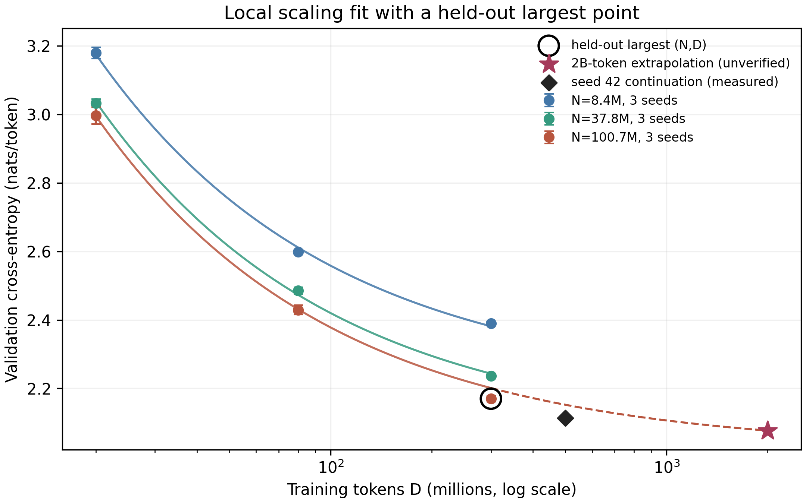

# 从头训练 0.1B 语言模型并评估可验证长程 Agent：预注册与过程记录（归档）

**最终结论与图表请读 [`FINAL_REPORT.md`](FINAL_REPORT.md)。** 本文件保留实验计划和按时间累积的过程日志；其中关于“正在续训”“待完成”的表述是当时的状态。2026-10-02 用户将计算任务转向语音模型后，旧的 0.1B 自动跟进已删除，约 2B token 续训在 500M 已验证点之后停止，正式后训练与双卡对照没有运行。

**状态（2026-10-02）：正式 3 模型 × 3 种子 × 3 token 预算的 scaling grid 已全部完成，并完成预留格检验与 bootstrap；同一 `base100m` seed 42 检查点正在从约 3 亿续训至约 20 亿 token。** 后训练和多卡正式对照仍待完成。本文中的表格没有虚构数据。“NeurIPS 风格” 指清楚的研究问题、受控对照、消融、统计不确定性、复现信息和局限，并不表示已有录用级贡献。

## 摘要

我们研究一个从原始语料、byte-level BPE、约 0.1B 参数 decoder-only Transformer 到后训练与长程 Agent 的完整可复现实验链。预训练模型采用 RoPE、RMSNorm、SwiGLU 与因果 scaled dot-product attention；另实现一个 Triton 前向注意力 kernel，并在相同输入上对照 PyTorch SDPA。我们拟在共同基座与固定评测集上比较 SFT、DPO 和可验证奖励强化学习（RLVR），并在确定性多步环境里比较 oracle imitation、在线验证奖励与自评候选选择。主要结果指标是 held-out loss、训练 token/s、推理 aggregate token/s、回答精确匹配率、长程任务成功率和成本。当前在一张 RTX 4090 的特定形状上观测到重复的 forward kernel 加速；这不是 Transformer 训练或端到端推理加速结论。

## 1. 研究问题与假设

- **H1 数据与规模：** 在固定清洗、tokenizer 和验证集下，随着参数量 (N) 与训练 token 数 (D) 增加，held-out cross-entropy 是否可由 (L(N,D)=E+A(N/10^6)^{-\alpha}+B(D/10^6)^{-\beta}) 的局部拟合近似？这是待检验假设，不能由 0.1B 单点推出。
- **H2 系统：** 手写 Triton forward 在特定 ((B,H,T,d)) 与 GPU 上是否比 SDPA 快，同时满足数值容差？多卡 DDP 是否提升 **aggregate** 训练/推理吞吐，扣除同步及通信成本后增益是多少？
- **H3 后训练：** 共同预训练 base 经 SFT 后，从同一 SFT checkpoint 分叉 DPO/RLVR，谁在 held-out arithmetic 精确匹配上改进？必须同时报告训练 FLOPs 或 GPU-hours、示例数和采样数。冷启动 RLVR 可能因稀疏奖励零方差而没有更新。
- **H4 长程 Agent：** 成功率如何随 horizon 增长？oracle imitation 后的在线 verifier 奖励是否改善同一批评测 seeds？self-judge 的候选重排是否提高成功率，是否增加计算量？

## 2. 方法

### 2.1 语料与切分

`fundamental/data.py` 读取含 `text/source/license` 的 JSONL 或指定许可的文本文件；执行 HTML 实体解码、轻量标签去除、空白清理、最小长度过滤、SHA-256 精确去重、SimHash 候选近重复过滤。按清洗后文本哈希固定划分 98/1/1；先切分，再仅用 train 训练 tokenizer。需要保存：原始数据来源、许可、下载日期、过滤前后文档数、token 数、数据混合比例、污染检查结果。轻量 HTML 正则不是网页抽取器；对真实 web dump 应增加格式专用解析与人工抽样审计。

**语料试点（用户选择：英文；首轮租卡预算 ¥100–500）：** 来源为 [FineWeb-Edu `sample-10BT`](https://huggingface.co/datasets/HuggingFaceFW/fineweb-edu)。云端容器连接 Hugging Face Hub 失败，转用本机访问官方 Dataset Viewer `/rows` API，将前 1000 行导出为本项目 JSONL；详见 4.5 节。数据卡标为 ODC-By，且提示受 Common Crawl 使用条款约束；正式发布语料或 checkpoint 前需复核适用条件。FineWeb-Edu 是已抽取、过滤的网页文本，**不是原始 WARC/WET dump**；原始 dump 解析与清洗仍是独立待做实验。不能把这 1000 条试点当作 0.1B 的充分训练语料。

### 2.2 Tokenizer 与模型

手写 byte-level BPE 使用 256 个 byte token、EOS/PAD 和逐步合并；能覆盖 UTF-8 且可往返解码。生产 run 默认词表 8192。模型配置 (d=768,L=10,h=12,d_{ff}=3072)，权重绑定，参数量由程序计数（约 1.01 亿，依词表而变）。目标函数是 next-token cross-entropy，验证集固定随机种子抽样。代码是教学参考实现，没有 KV cache、数据混合调度、激活重算或 ZeRO/FSDP；这些限制会影响可训练长度和效率。

### 2.3 Triton 与分布式

Triton kernel 将 QK、因果 mask、online softmax 与 PV 合并，保存每行最大值 (m_i)、归一化和 (l_i)、加权累加 (a_i)；块间按

\[
m'=\max(m,\max s),\quad
l'=e^{m-m'}l+\sum_j e^{s_j-m'},\quad
a'=e^{m-m'}a+\sum_j e^{s_j-m'}v_j
\]

更新，最终输出 (a/l)。仅实现 **forward**；训练仍用 PyTorch SDPA。kernel 对照需固定 dtype、张量形状、mask、GPU、warmup 和计时轮数，先验收误差再测时。多卡用 DDP 复制模型；训练比较同一全球 token batch、序列长度和累计 token budget。推理脚本是**全上下文重算、无 KV cache**，只报告其自身的请求吞吐，不能与生产推理框架混称。

### 2.4 Scaling law

至少 3 个模型尺寸 × 3 个 token budget；每点至少 3 个 seed，训练/验证数据分布一致。留出最大 ((N,D)) 点作为外推检验。用非负系数约束网格搜索拟合 (E,A,B,\alpha,\beta)，报告训练 RMSE、留出绝对误差、残差图与 bootstrap 区间。Bootstrap 在每个模型尺寸内抽取完整 seed 训练轨迹，使同一次运行的三个 D 点一起重采样；该区间主要反映训练随机性，不覆盖语料选择与硬件系统误差。若不同模型曲线交叉或残差系统性偏离，不能把拟合外推到新的数量级。FLOPs 需按实际操作或 profiler 记录，(6ND) 只能作为粗估。

### 2.5 后训练

主对照是 `base→SFT`、`SFT→DPO`、`SFT→RLVR`，后两者加载同一 SFT hash；另测 `base→DPO/RLVR` 冷启动消融。SFT 最小化 completion token 的负对数似然；DPO 使用冻结的分叉起点作为 reference，最小化

\[
-\log\sigma\{\beta[(\log\pi_\theta(y^+|x)-\log\pi_\theta(y^-|x))-(\log\pi_{ref}(y^+|x)-\log\pi_{ref}(y^-|x))]\}.
\]

RLVR 在每个 prompt 采样一个 group，用严格全文匹配 verifier 给二值奖励，组内标准化后做简化 on-policy REINFORCE，并加入精确词表分布 KL。**这不是完整 PPO/GRPO 实现**；没有旧策略 clipping、多轮 minibatch 或 value model。SFT、DPO、RLVR 的样本顺序按各自 seed 洗牌，每轮结束后重洗；三个 seed 因而对应不同的数据次序，RLVR 还对应不同的采样轨迹。所有分支记录 step、数据量、失败采样比例和是否因组内奖励无差异跳过更新。

### 2.6 长程环境与 self-judge

`ArithmeticChainEnv` 用 seed 生成一串必须逐步到达的 checkpoint。每步 action 格式为 `ADD n`，verifier 用整数规则检查；错误动作立即终止。horizon 为 4/8/16，保持评测 seeds 不参与 oracle 收集。先在 oracle 轨迹上做 imitation，按训练 seed 洗牌轨迹次序，再用真实环境回报做简化在线 policy gradient。self-judge 让同一模型对多个候选回答 YES/NO 并排序；**judge 分数不进入成功率真值**。应同时评估同 checkpoint 的 judge on/off，报告每次决策候选数、推理 token 与 wall time，以避免用额外采样量伪装算法收益。

## 3. 预注册实验矩阵

| 实验 | 固定变量 | 变化变量 | 主要指标 | 统计计划 |
|---|---|---|---|---|
| 语料/Tokenizer | 原始 corpus、划分 | 清洗开关、BPE vocab | held-out loss、bytes/token | 3 seeds，记录过滤率 |
| Scaling | 语料、训练 recipe | small/medium/base100m × 3 token budgets | val CE, fit/holdout error | 每点 3 seeds，按 seed 轨迹 bootstrap |
| Attention | 相同 QKV 和 GPU | SDPA / Triton、T、dtype | max abs error、forward ms | warmup 后 100 次，p50/p95 |
| 多卡训练 | 相同 N、D、global batch | 同宿主机 1/2 GPU；若可用再测 4 GPU | tokens/s、GPU-hours、最终 val CE | 至少 3 次，记录硬件 |
| 多卡推理 | 同 checkpoint/prompt/请求配置 | 同宿主机 1/2 GPU；若可用再测 4 GPU | aggregate tokens/s、batch latency | warmup，固定生成长度；区分每卡负载和总请求固定 |
| 后训练 | 同 base、评测集 | base/SFT/DPO/RLVR | EM、Wilson 95% CI、成本 | 3 seeds，成对题目分析 |
| Agent | 同 checkpoint/seed/horizon | imitation/RL；judge on/off | episode success、有效步数、成本 | 100+ episodes，配对 bootstrap |

## 4. 结果占位（待真实运行）

| 条件 | 运行 ID / checkpoint hash | 设备与时长 | 结果 ± 区间 | 解释 |
|---|---|---|---|---|
| Base held-out CE | 待填 | 待填 | 待填 | 待填 |
| Triton / SDPA forward speedup | 2026-10-01 用户终端回传；原始值见 4.1–4.2 节 | RTX 4090；3 种长度各重复 3 次 | 0.5923× / 0.6575× / 0.9281×（T=128/512/1024；中位数） | 未剪枝基线；三种长度均低于 1 |
| 缩短因果循环后的 forward speedup | 2026-10-01 用户终端回传；原始值见 4.3 节 | 同一 RTX 4090；3 种长度各重复 3 次 | 0.5840× / 0.6828× / 1.2937×（T=128/512/1024；中位数） | T=1024 有一次显著慢样本；定点复测见 4.4 节 |
| 剪枝版 T=1024 定点复测 | 2026-10-01 用户终端回传；原始值见 4.4 节 | 同一 RTX 4090；5 次运行，每次计时 1000 调用 | 1.2966×（中位数；范围 1.2957–1.3002×） | 仅 forward、仅此形状；与短跑协议的计时轮数不同 |
| 1→4 GPU train speedup | 待填 | 待填 | 待填 | 待填 |
| SFT / DPO / RLVR EM | 待填 | 待填 | 待填 | 待填 |
| Agent H=4/8/16 success | 待填 | 待填 | 待填 | 待填 |

要报告 speedup，计算 (t_1/t_k) 或 throughput 比，并说明是否固定 global batch、总 token 和运行轮数。要报告“提升”，给出同题目成对差异与置信区间；微型 synthetic smoke run 不能作为语言能力证据。

### 4.1 首次云端实测：Triton attention forward

2026-10-01，用户在 AutoDL RTX 4090 实例终端回传以下结果。`python -m pytest -q tests/test_triton_attention.py` 显示 **6 passed in 5.44s**；六组覆盖序列长度 33/128/513、head dimension 32/64、fp16 的前向输出，并与 PyTorch SDPA 逐元素比较。随后运行 `python -m fundamental.bench attention --seq-len 512 --out runs/attention_gpu.jsonl`，得到：

| 条件 | 值 |
|---|---:|
| Q/K/V 形状 | `[2, 12, 512, 64]` |
| 输入 dtype | fp16 |
| 最大绝对误差 | 0.00048828125 |
| PyTorch SDPA 平均 forward | 0.019367635 ms |
| Triton 平均 forward | 0.029282197 ms |
| 速度比 `SDPA_ms / Triton_ms` | 0.661413× |

这组输入下自写 kernel 的耗时约为 SDPA 的 **1.51 倍**。数值正确性通过了当前容差，但“更快”的 H2 子假设在这个单点没有得到支持。计时方法是各预热 10 次后，以 CPU 墙钟计时 100 次调用，并在前后同步 GPU；记录的是 Q/K/V 已存在时的 **forward 运算**，没有 backward、Transformer 训练或端到端推理时间。当前脚本每次只输出 100 次调用的均值，PyTorch 具体选用了哪个 SDPA backend 也未记录；跨长度的重复测量见 4.2 节。

同一实例上，教学版 tiny 模型用合成语料完成 20 步训练：参数 1,115,264，累计输入 token 640，验证损失从 4.765268 降到 4.317125。此结果只确认数据处理、训练和 checkpoint 路径可执行，不能当作 0.1B 模型的语言能力或 scaling-law 证据。

### 4.2 第一轮长度扫描：同一 RTX 4090，未优化的 kernel

用户随后对 128、512、1024 三个序列长度各运行 3 次；其他参数固定为 batch=2、heads=12、head dimension=64、fp16、每次 10 次预热和 100 次计时。原始 JSONL 保存在 [`data/attention_4090_round1.jsonl`](data/attention_4090_round1.jsonl)。下表的两个时间分别是 3 次运行的中位数；速度比是每次成对 `SDPA_ms / Triton_ms` 后再取中位数，因此不要求等于两个时间中位数之比。

| 序列长度 | SDPA 中位数（微秒） | Triton 中位数（微秒） | 成对速度比中位数 | 3 次速度比范围 |
|---:|---:|---:|---:|---:|
| 128 | 17.024 | 29.713 | 0.5923× | 0.5694–0.6071× |
| 512 | 19.306 | 29.363 | 0.6575× | 0.6537–0.6830× |
| 1024 | 62.750 | 67.611 | 0.9281× | 0.9273–0.9537× |

全部 9 次的最大绝对误差不超过 0.0009765625；所有成对速度比均低于 1。差距随长度增大而缩小，但 1024 长度尚未反超。3 次重复只说明当前实例上这些短跑的范围，不能充当跨实例或跨日期的置信区间。当前 kernel 对每个 query 块遍历全部 key 块，包括因果遮罩后必然不可见的未来块。下一候选优化只缩短这个循环上界，保持 Q/K/V、精度、块大小和 benchmark 方法不变。候选代码在本地通过了 Python 编译和 CPU 测试；云端初测见 4.3 节。

### 4.3 因果循环剪枝：云端初测与异常值

唯一的源码改动是将 Key 循环上界从 `ceil(T/BN)` 改为 `ceil((block_m+1)×BM/BN)`，即每个 Query 块只遍历它能看到的 Key 块。用户在同一 RTX 4090 上按 4.2 节协议再次完成 3×3 扫描。原始 JSONL 保存在 [`data/attention_4090_round2.jsonl`](data/attention_4090_round2.jsonl)。每次 benchmark 都先与 SDPA 数值比较，9 次均未触发断言，最大绝对误差均为 0.00048828125。独立六组参数化测试的输出后来补交，见 4.4 节。

| 序列长度 | SDPA 中位数（微秒） | 剪枝 Triton 中位数（微秒） | 成对速度比中位数 | 3 次速度比范围 |
|---:|---:|---:|---:|---:|
| 128 | 16.830 | 28.409 | 0.5840× | 0.5724–0.6098× |
| 512 | 19.363 | 28.371 | 0.6828× | 0.6756–0.6848× |
| 1024 | 62.649 | 48.427 | 1.2937× | **0.5992–1.2946×** |

与未剪枝版本的 1024 长度中位数 67.611 微秒相比，剪枝版本中位数 48.427 微秒，降低约 28.4%。但第三次剪枝运行耗时 **105.112 微秒**，超过未剪枝版本的所有三次结果。它是原始观测的一部分，不能删除或把 1.2937× 写成稳定加速。若改用三次均值，剪枝版约 67.301 微秒、基线约 67.678 微秒，结论几乎没有差异；这说明样本量太少且对汇总方式敏感。当前 100 次调用的 CPU 墙钟平均值可能受到调度、GPU 负载或频率等因素影响，具体原因尚未测定。下一步用更多重复和 1000 次计时轮数专门复测长度 1024，并记录运行环境；随后再决定是否进行交替 A/B 测量或改用 GPU 事件计时。

### 4.4 T=1024 定点复测：5 次 × 1000 调用

用户保持剪枝版与相同张量形状 `[2,12,1024,64]`，把每次 benchmark 的计时调用从 100 增到 1000，重复 5 次。原始记录为 [`data/attention_4090_confirm_1024.jsonl`](data/attention_4090_confirm_1024.jsonl)。SDPA 耗时中位数 **62.554 微秒**，Triton 耗时中位数 **48.245 微秒**；每次成对速度比的中位数 **1.2966×**，范围 **1.2957–1.3002×**。全部 5 次的最大绝对误差为 0.00048828125。先前的 105.112 微秒异常未在这五次中重现，但具体原因仍未知。

这一结论限定为：**该 RTX 4090、fp16、batch=2、heads=12、T=1024、head dimension=64 下，Q/K/V 已就绪时的前向调用耗时**。100 次与 1000 次协议的跨版本结果不能直接当作严格配对消融；若要估计“剪枝本身”的效应，应在 1000 次协议下交替运行旧版和新版。训练仍使用 PyTorch SDPA。用户随后补交剪枝版独立 GPU 测试结果：`6 passed in 2.19s`。

### 4.4a 更长上下文的补充测量

同一 RTX 4090 上，继续对 `[2,12,T,64]` 的 fp16 前向测试，`T=2048` 与 `4096` 各独立运行三次；每次先数值比较，再预热 10 次并分别计时 300 次调用。实例环境记录为 NVIDIA driver **580.76.05**、PyTorch **2.8.0+cu128**、CUDA runtime **12.8**、Triton **3.4.0**，GPU 显存 **24,564 MiB**、功率上限 **450 W**。原始记录见 [`attention_long.jsonl`](data/cloud/attention_long.jsonl)。

| T | SDPA 中位数（微秒） | Triton 中位数（微秒） | 成对速度比中位数 | 最大绝对误差上界 |
|---:|---:|---:|---:|---:|
| 2048 | 146.616 | 151.918 | 0.9650× | 0.0009765625 |
| 4096 | 466.238 | 505.049 | 0.9101× | 0.00048828125 |

这两个长度下手写 kernel 均比 SDPA 慢；因此 T=1024 的局部加速不能概括成“长上下文普遍加速”。本测量仍是 GPU 调用的 CPU 墙钟均摊值，未测 backward 或端到端 Transformer 吞吐。

再使用 [`attention_ab.py`](../scripts/attention_ab.py) 做 CUDA Event 计时：每个长度做 **10 对** A/B 测量，每对各 300 次调用，测量顺序交替为 SDPA→Triton 与 Triton→SDPA，且使用相同已生成的 Q/K/V。30 对原始记录见 [`attention_event_ab.jsonl`](data/cloud/attention_event_ab.jsonl)。

| T | SDPA Event 中位数（微秒） | Triton Event 中位数（微秒） | 成对速度比中位数 | 速度比范围 |
|---:|---:|---:|---:|---:|
| 1024 | 62.523 | 48.212 | 1.2936× | 1.2578–1.2992× |
| 2048 | 136.952 | 141.964 | 0.9663× | 0.9590–0.9783× |
| 4096 | 436.770 | 508.497 | 0.8585× | 0.8542–0.9205× |

所有输入相同且输出通过 `atol=rtol=0.02` 的 PyTorch 对照检查；本轮观测最大绝对误差为 0.00048828125。[图：逐次速度比与中位数](figures/attention_event_ab.png)同时显示所有配对点，另提供[矢量 PDF](figures/attention_event_ab.pdf)。交替顺序和 Event 计时支持 1024 形状的局部加速结论，但 10 对同机样本仍不足以推断跨机器置信区间，也没有测 kernel backward、QKV 投影或整模型训练。

### 4.5 FineWeb-Edu 真实文本导入：云端连接失败与本机数据包

云端 RTX 4090 容器的 `datasets==5.0.1` 已安装，但访问 `huggingface.co` 的 HEAD 请求连续重试后报 `[Errno 99] Cannot assign requested address`；`fundamental.import_hf` 因此未生成原始 JSONL。随后运行的清洗命令在旧版代码中对不存在的输入产生了 `counts: {}` 的空 manifest，**不是有效语料结果**。本地 `fundamental.data.clean` 已补充缺失输入检查与回归测试；这项修复尚未同步到云端旧包。

本机可访问 Hugging Face 官方 Dataset Viewer，因此使用 [`scripts/download_fineweb_pilot.py`](../scripts/download_fineweb_pilot.py) 分 10 页、每页 100 行，读取 `sample-10BT` 的**前 1000 行**。逐页检查 `partial=false`、行号连续、`truncated_cells=[]`、正文和来源字段非空。导出的 [`raw/fineweb_edu_pilot.jsonl`](../raw/fineweb_edu_pilot.jsonl) 为 5,204,297 字节，SHA-256 为 `ee8301fdc6341f12c91c8b6ae28ee5cd3e60e4990de0d31e03668a43f5d8dc9c`；元数据见 [`raw/fineweb_edu_pilot.manifest.json`](../raw/fineweb_edu_pilot.manifest.json)。本机同版清洗程序输出 `raw=1000, train=969, val=14, test=17`，用时约 17 秒。前 1000 行不是随机抽样，也没有足够 token 支撑 0.1B 训练。

用户上传 [`dist/fineweb_edu_pilot.zip`](../dist/fineweb_edu_pilot.zip) 后，云端清洗输出同样为 `raw=1000, train=969, val=14, test=17`，墙钟时间 **6.975 秒**。`df -h /root/autodl-tmp` 显示独立数据盘 50GB、当时可用约 50GB。云端随后回传原始 JSONL 的 SHA-256 `ee8301fdc6341f12c91c8b6ae28ee5cd3e60e4990de0d31e03668a43f5d8dc9c`，与本机一致。

### 4.6 手写 BPE 的真实文本试点（本机与云端复现）

在上述 `clean_fineweb_pilot/train.jsonl` 上用 `fundamental.tokenizer` 训练 **2048 词表**的 byte-level BPE，限制词表训练读取前 2,000,000 字节（按程序逐 piece 计数），本机约 **25.7 秒**。再编码三个固定切分，本机约 **16.5 秒**，得到：train **2,225,271** token、val **71,566** token、test **28,781** token；train 文本 4,696,363 UTF-8 字节，约 **2.11 bytes/token**。Tokenizer 文件 SHA-256 为 `4b26f406ed48b5b60a76f16672942c495f328ba72fa6226c55557883c3be62b3`。这些是当前试点与 2048 词表的测量，未来 8192 词表会改变 token 数和模型 embedding 维度。即使用 train 全部 222.5 万 token 只训练一轮，对约 1 亿参数也仅约 0.022 token/parameter；这批数据只用于管线与吞吐试点。

云端重现了相同的原始 JSONL SHA-256、2048 词表大小、Tokenizer SHA-256、英文句子往返编码，以及三个 split 的精确 token 数。云端 BPE 训练耗时 **6.385 秒**，编码打包耗时 **7.656 秒**。这确认了跨机器的输入与 Tokenizer 字节级一致性。下一阶段只对该试点做接近 0.1B 的短训练探针，测 GPU 训练吞吐和 checkpoint 体积，再规划正式语料规模。

### 4.7 约 0.096B 模型的 4090 单卡训练探针

用户在 RTX 4090（BF16 可用）上，以 2048 词表、`base100m` 架构、序列长度 256、单卡 micro-batch 1、每步全局 2048 token、随机种子 42，训练 20 步。实际参数 **95,960,832**；这与目标 8192 词表下的 100,679,424 参数不同。每步做 8 次梯度累积；累计训练 **40,960** token。训练仍用 PyTorch SDPA，未接入实验性 Triton forward kernel。

| 步数 | 累计 token | train loss | val loss | 该段训练吞吐（token/s） |
|---:|---:|---:|---:|---:|
| 10 | 20,480 | 5.2583 | 5.5273 | 3,626.3 |
| 20 | 40,960 | 4.7982 | 5.1208 | 4,004.9 |

程序日志记录总计含评估 **10.937 秒**；外部 shell `time` 测得 **18.789 秒**，差额主要落在程序计时区外的初始化、最终 checkpoint 写入及进程开销，当前未逐项剖析。`base.pt` 约 **367MB**，可恢复训练的 `latest.pt` 约 **1.1GB**，均存于 50GB 数据盘。验证损失下降 0.407，只表明此小样本短跑在固定抽样验证片段上可优化；不能证明通用语言能力。

若暂以第二段 **4,004.9 token/s** 和截图单价 **¥1.88/小时** 机械外推，1 亿 / 10 亿 / 20 亿 token 的**纯训练时间下界式估算**分别约 **6.94 / 69.36 / 138.72 小时**，对应 **¥13 / ¥130 / ¥261**。这个计算排除了语料获取、Tokenizer、评估、保存、失败重跑及闲置时间，并假设吞吐不变；最终 8192 词表、序列长度 1024 的吞吐可能不同。下一步先在目标配置上短跑测吞吐，再确定预算内的正式 token 数。当前训练集只有 222.5 万 token；反复抽样到十亿级不等于拥有十亿个独立训练 token。

### 4.8 目标配置的本地数据准备与云端 GPU 探针

为隔离词表大小和上下文长度对训练速度的影响，本机用相同的 FineWeb-Edu 试点、相同的 2,000,000 字节词表训练上限，另训 **8192 词表** BPE。其 SHA-256 为 `391632fa825ea8b9d04a0e20eb3d03d72c98bd6156375152859a3a7fde0fd12a`，云端复现哈希一致。打包后 train / val / test 分别为 **1,870,710 / 60,636 / 24,326** token；同一架构的参数量为 **100,679,424**。云端以 `seq_len=1024`、micro-batch 1、全局每步 8192 token、种子 42 训练 20 步，累积 **163,840** token：

| 步数 | train loss | val loss | 该段训练吞吐（token/s） | 含验证的程序累计耗时（s） |
|---:|---:|---:|---:|---:|
| 10 | 5.3562 | 5.5069 | 14,855.6 | 5.607 |
| 20 | 4.9096 | 5.0266 | 16,010.5 | 10.812 |

与 4.7 节的 2048 词表、256 长度探针相比，不能直接比较 token 级 loss，因为分词规则不同。较长序列在这台 GPU 上提高了报告的**纯训练区间** token/s；该指标排除验证和最终 checkpoint 写入。按第二段吞吐与用户截图的 ¥1.88/小时机械外推，10 亿、20 亿 token 分别约 **17.35、34.70 小时**，纯训练费用约 **¥32.62、¥65.24**。这些仍不是正式实验的总预算估算：数据清洗、评估、保存、后训练、scale grid、多卡和闲置时间均未计入。此 8192 词表只在约 2MB 文本上学习，适用于配置探针；正式训练需用更大且独立的语料重新确定词表及训练集，改变词表后不能直接沿用旧 checkpoint。

### 4.9 正式语料准备：FineWeb-Edu 两个完整 Parquet 分片

使用 AutoDL 官方文档的 `source /etc/network_turbo` 学术资源代理后，云端可连接 Hugging Face；无代理时对 `huggingface.co:443` 连接超时。直接从 [FineWeb-Edu `sample/10BT` 文件目录](https://huggingface.co/datasets/HuggingFaceFW/fineweb-edu/tree/main/sample/10BT) 获取相邻的 `000_00000.parquet` 和 `001_00000.parquet`，各约 2.15 GB。下载后 SHA-256 分别为 `b1ba7b2ce4cb5ea6ef42dca40263eabb85f37700d01693a68e9b30a31d78e871` 与 `3fcf2dc69cd52503986276d3d2d26a8c356d0f2ea28a0de4fdbda8cf87755693`，与官方文件页一致。两分片分别有 **726,000**、**729,000** 行，流式导出成项目 JSONL 后字节数为 **3,720,660,093**、**3,724,216,007**；没有空文本或缺失来源。原始导出清单见 [`000`](data/cloud/fineweb_shard_000_manifest.json)、[`001`](data/cloud/fineweb_shard_001_manifest.json)。

对 Parquet 元数据逐行汇总（见 [`source_audit.json`](data/cloud/fineweb_source_audit.json)）：**1,455,000/1,455,000** 行的语言字段为 `en`，来源自带的 `token_count` 总和为 **1,508,672,681**，均值 **1,036.9**、中位数 **631**；语言分数均值 **0.9361**，质量分数均值 **3.0058**。来源的 token 计数不是本实验 8192 BPE 的 token 数，后者要在打包后另测。两个分片合并清洗后，固定哈希切分得到 **1,416,623** 篇 train、**14,396** 篇 val、**14,580** 篇 test；移除 **7,769** 篇完全重复与 **1,632** 篇近重复。精确计数见 [`全量清洗清单`](data/cloud/fineweb_clean_manifest.json)。

正式 tokenizer 的拟合语料仅取自清洗后的 train：按正文 SHA-256 排序，在 50,000,000 UTF-8 正文字节预算内确定性选择 **10,397** 篇、**49,999,833** 字节。训练输入的 SHA-256 是 `877a1ff88c77b202a175eb57137acf82204b22875633bab4dda07c36f6a5cca0`，抽样输出 SHA-256 是 `14d53b2370bafe8ffed70972766bee1c81e387e6e3a463849b0a98cf77e2a060`，完整元数据见 [`tokenizer_sample_manifest.json`](data/cloud/tokenizer_sample_manifest.json)。这一划分防止 val/test 文本直接参与分词器拟合；跨语料潜在重复仍需另行审计。该样本训练出的 8,192 词表文件见 [`tokenizer_8192.json`](data/cloud/tokenizer_8192.json)，SHA-256 为 `104fbc43dfa88b2da61b7bbbef87d126a720eac12dfcef876dc23bcb2ad28e7a`。

全量编码后，train/val/test 分别为 **2,685,790,665 / 27,400,609 / 27,098,920 token**，每篇末尾加入 EOS；精确文件格式与篇数见 [`full_token_manifest.json`](data/cloud/full_token_manifest.json)。train 规模约为 0.1B 参数量的 **26.7 token/parameter**；计划中的 2B token 优化步数约为 **19.9 token/parameter**，但训练窗口为随机有放回抽样，不能等同于恰好遍历一次 2B 个不同 token。为缩短准备时间，用 [`parallel_pack.py`](../scripts/parallel_pack.py) 在 JSONL 行边界分段编码，再按输入顺序拼接。在 1000 篇试点上，train/val/test 三个二进制文件的 SHA-256 均与串行编码逐字节相同；全量数据上，停止串行编码时已生成的前 **2,646,804,236** 字节也与并行结果同长前缀完全一致。三个正式二进制文件的长度均等于清单 token 数的两倍，篇数也与清洗清单一致。

正式数据和正式 tokenizer 上重新做目标配置探针：`base100m` 为 **100,679,424 参数**，RTX 4090，BF16，`seq_len=1024`，每步全局 **8192 token**，随机种子 42。第 10/20 步验证损失分别 **5.3849/5.1133**，对应训练区间吞吐 **14,803/17,030 token/s**；前 20 步只看了 **163,840 token**，仍不代表语言能力。完整两行指标见 [`full100m_probe_metrics.jsonl`](data/cloud/full100m_probe_metrics.jsonl)。同一分词器与数据上的 scaling grid 初版曾按 [`初始配置清单`](data/cloud/scaling_grid_manifest_initial.json)启动：small/medium/base100m 三种尺寸，各种子 42/43/44，固定上下文 1024、每步 8192 token，在约 20M/80M/300M token 评估。正式 v2 的每次验证取同一固定种子的 **32 批 × 8 条 × 1024 token = 262,144 token**。

正式 grid 的初版 micro-batch=1 在 small 模型上 GPU 利用率很低，于第一轮尚未输出验证点时人为中止，保留失败状态而不纳入拟合。额外的同数据、同全局 8192 token、20 步短探针把单卡 micro-batch 调到 4 或 8：`base100m` 的 batch=4 报告 **52,674 token/s**，batch=8 为 **74,270 token/s**；batch=8 的 small/medium 分别为 **110,998/95,191 token/s**。原始指标见 [`batch4`](data/cloud/probe_batch4_metrics.jsonl)、[`batch8`](data/cloud/probe_batch8_metrics.jsonl)、[`small batch8`](data/cloud/probe_small_batch8_metrics.jsonl)、[`medium batch8`](data/cloud/probe_medium_batch8_metrics.jsonl)。这些是短跑与不同评估时点的吞吐观测，不能当严格配对的稳态加速；并且 batch=1 与 batch=8 的 20 步验证损失有差异，训练轨迹并不完全相同。正式 3×3×3 grid 按 [`v2 配置清单`](data/cloud/scaling_grid_v2_manifest_initial.json)统一使用 **batch=8、梯度累积=1、每步 8192 token**，重新从头启动，不混用中止的 batch=1 数据。

v2 grid 的 `small` 模型三个种子均跑完 **36,621 步、299,999,232 token**。seed 42/43/44 的三个验证点 loss 分别为 **3.1953 / 2.6049 / 2.3895**、**3.1812 / 2.5936 / 2.3932**、**3.1624 / 2.5985 / 2.3874**；耗时分别约 **1,823.7 / 1,868.6 / 1,832.6 秒**（含验证与 checkpoint）。原始逐点记录见 [`seed 42`](data/cloud/scaling_small_seed42_metrics.jsonl)、[`seed 43`](data/cloud/scaling_small_seed43_metrics.jsonl) 与 [`seed 44`](data/cloud/scaling_small_seed44_metrics.jsonl)；九条最终状态见 [`grid manifest`](data/cloud/scaling_grid_v2_manifest_final.json)。

2026-10-01 18:58 UTC 起原 Jupyter 反向代理连续返回 HTTP 404；用户随后确认账户欠费并充值。2026-10-02 恢复访问时，原训练进程已不在、4090 空闲、数据盘剩余约 **20GB**；grid manifest 显示 `small_seed44` 也已完成，`medium_seed42` 留有一次验证记录和 driver 日志但没有 `latest.pt`。先复制该目录为 `medium_seed42_interrupted_20261001` 保留中断证据，再以相同配方重启 grid runner；其日志明确跳过三个已完成的 `small` 运行并从头启动 `medium_seed42`。重新训练的 `medium` seed 42/43/44 在 20M/80M/300M token 的验证 loss 分别为 **3.0190 / 2.4962 / 2.2389**、**3.0418 / 2.4830 / 2.2356**、**3.0369 / 2.4764 / 2.2336**；原始记录见 [`seed 42`](data/cloud/scaling_medium_seed42_metrics.jsonl)、[`seed 43`](data/cloud/scaling_medium_seed43_metrics.jsonl)、[`seed 44`](data/cloud/scaling_medium_seed44_metrics.jsonl)。此前中断的首点不与新轨迹混合。Jupyter 登录凭据已轮换，旧的直接 API 连接返回 403；后续从已登录的 JupyterLab 会话读取记录。访问事件见 [`access_incidents.jsonl`](data/cloud/access_incidents.jsonl)。

`base100m` 三个种子均已完成 **36,621 步、299,999,232 token**。seed 42/43/44 的 20M/80M/300M 验证 loss 分别为 **3.0250 / 2.4450 / 2.1791**、**2.9901 / 2.4224 / 2.1689**、**2.9767 / 2.4204 / 2.1616**；原始记录见 [`seed 42`](data/cloud/scaling_base100m_seed42_metrics.jsonl)、[`seed 43`](data/cloud/scaling_base100m_seed43_metrics.jsonl)、[`seed 44`](data/cloud/scaling_base100m_seed44_metrics.jsonl)。最后一条于 2026-10-02 05:32 UTC 以返回码 0 结束，九条状态均为 `complete`。末段 `base100m` 训练吞吐约 **95.7–95.8k token/s**；此指标仅为训练区间，不含验证和保存。

最终 manifest 中九条作业从启动到退出的时长合计 **6.025 GPU 小时**（small **1.535**、medium **1.855**、base100m **2.635** 小时），包含验证与 checkpoint。按 2026-10-02 [AutoDL 公示的 RTX 4090 ¥1.88/小时](https://www.autodl.com/home)机械相乘为约 **¥11.33** 的九条作业计算时长；这**不是账户实际账单**，不含欠费中断、实例空闲、数据准备、磁盘、长训与后训练。当前浏览器没有 AutoDL 控制台登录态，不能核实余额和总扣费；租第二台或双卡实例前须核对账户账单与用户的 ¥100–500 上限。

### 4.9.1 预留格检验与局部 scaling 拟合

以各 `(N,D)` 三个种子的固定验证损失均值组成九个格子；拟合 `L=E+A(N/10^6)^(-α)+B(D/10^6)^(-β)` 时预留最大 `(N,D)=(100,679,424,299,999,232)` 格，只用另外八格估计参数。受限非负系数网格搜索得到 `E=1.96945`、`A=0.83411`、`B=6.33110`、`α=0.600`、`β=0.625`，拟合八格的均方根误差 **0.00768 nats/token**。预留格预测 **2.20104**，三个种子实际均值 **2.16986**（标准差 **0.00877**），绝对预测误差 **0.03118 nats/token**。这比种子间散布大；说明此简单可加幂律在范围边缘存在可观模型误差，不能用种子重采样区间代替外推可靠性。

按模型大小对三个种子的完整学习轨迹成组重采样 200 次，200 次成功。预留格**预测分布**的百分位 95% 区间为 **[2.18659, 2.22217]**，实际均值 2.16986 位于区间外；这不是覆盖模型形式偏差的完整预测区间。向同一 100,679,424 参数模型的 **20 亿 token** 外推得到 **2.07661 nats/token**，仅重采样区间 **[2.05769, 2.10454]**。20 亿是测量范围最大 D 的 6.67 倍，该数字是待检验预测，不是已测性能，也没有对训练数据重复抽样和领域偏移做不确定性校正。拟合原始输出和验证配方见 [`scaling_fit.json`](data/cloud/scaling_fit.json)；九个 JSONL 共 27 条原始观测。图中的空心圆是预留格，虚线是未验证的 20 亿外推：

拟合后的同一 `base100m_seed42/latest.pt`（包含模型、优化器与随机数状态）从 **299,999,232 token** 继续训练，目标第 **244,141** 步、**2,000,003,072 token**；数据、8192 词 tokenizer、全局 batch 8192、单卡 BF16、验证种子与批次数保持相同。计划在约 500M、1B、2B token 复测，定期覆盖写入可恢复 checkpoint。启动后实测 GPU 利用率 **98%**、显存约 **7.3 GiB**、数据盘尚余 **14 GiB**；仍在运行，不能报告最终 loss 或端到端效果。

续训第一个独立监测点 **499,998,720 token** 已完成：seed 42 验证损失 **2.11379**、上一区间训练吞吐 **95,762 token/s**，从 300M 时同 seed 的 **2.17908** 继续下降。仅用 20M/80M 的格子拟合、预留 300M 的上述幂律，在 500M 预测 **2.15207**，比实测高 **0.03828 nats/token**；这是又一个方向相同的模型形式偏差证据。500M 目前只有一个 seed，不能与前三点的三个种子均值直接当成配对估计，也不能据此修正原预注册拟合后仍称它为预留预测。原始记录见 [`base100m_2b_metrics_partial.jsonl`](data/cloud/base100m_2b_metrics_partial.jsonl)。

在前 10,000 篇上，原 `SimHash` 清洗耗时 **68.17 秒**；改为 NumPy 批量位投票后耗时 **12.90 秒**，速度约 **5.28×**。两版 train/val/test 文件的 SHA-256 逐一相同，三个 split 计数也相同；这是清洗实现优化，不是模型吞吐提升。Tokenizer 逐 piece BPE 增加有界缓存后，对 1000 篇试点重新打包耗时 **2.86 秒**，输出三个 `.bin` 的 SHA-256 与旧版逐一相同。优化只减少重复计算，不改变算法输出。

### 4.10 Common Crawl WET 归档解析与清洗试点

另从 [Common Crawl 的 WET 文件清单](https://data.commoncrawl.org/crawl-data/CC-MAIN-2025-43/wet.paths.gz) 选取首个归档，来源 URL 与文件 SHA-256 见 [`WET 原始导出清单`](data/cloud/wet_pilot_raw_manifest.json)。WET 是 **WARC Encapsulated Text**，存放抓取网页已抽取的纯文本；它比 FineWeb-Edu 更接近抓取 dump，但不是原始 HTML WARC。[Common Crawl 格式说明](https://commoncrawl.org/get-started) 记录了两者区别。手写解析器按 WARC 头与 `Content-Length` 读取，筛选前 **10,000** 条 conversion 记录中的 `eng` 标签，得到 **6,309** 篇、50,703,482 字节 JSONL；排除 **3,687** 条其他语言、4 条过短文本。UTF-8 替换字符计数为 **2,151**。其中 `commoncrawl-access-terms` 只是访问条款标签，**不等于逐网页内容获得开源许可**，因此这批文本暂不混入主训练集。

再经同版清洗得到 train/val/test **6,028/62/73** 篇，去掉 **139** 条完全重复与 **7** 条近重复；清单见 [`WET 清洗统计`](data/cloud/wet_pilot_clean_manifest.json)。此试点证明归档解析到去重切分的管线可运行，尚未进行网页内容授权审计或大规模原始 WARC HTML 抽取。

### 4.11 0.1B 短探针上的后训练与 Agent 接口检查

以 4.8 节只训练 **163,840 token** 的 base 进行 20 步 SFT，完成 token 的训练损失从 **8.053** 降到 **6.062**；同一 SFT checkpoint 分叉各 20 步 DPO 与 RLVR。RLVR 的 **20/20** 步采样组奖励均为 0、组内方差为 0，因此全部跳过梯度更新。旧版保留的 50 道范围外算术题上，base、SFT、DPO、RLVR 均为 **0/50**，Wilson 95% 上界约 **7.14%**；逐题结果见 [`posttrain_probe_eval.json`](data/cloud/posttrain_probe_eval.json)。这些只是接口和失败模式检查，不能作为算法相对性能结论。正式实验另构造 900 道训练题、100 道同范围留出题和 200 道范围外题，固定哈希切分，待长训 base 上重做。

同一探针上，Agent oracle imitation 的第 1/20 步损失为 **7.537/5.222**；在相同 10 个评测 seeds、horizon=4 下，self-judge 关/开均为 **0/10**。关闭时采样 **10** 个候选、约 **1.26 秒**决策时间；开启后采样 **30** 个候选、约 **3.54 秒**决策时间，没有观察到成功率提升。此旧探针的候选数并不匹配，不能把差异归因于 judge。正式评测代码现使两组都按 `--candidates` 采样相同数量，关闭 judge 时选第一个候选，开启时由模型评分选一个；在线 verifier 奖励训练仍只用一个候选。旧探针在线训练的 10 次试探均为 0 奖励。当前比较只验证 harness 可运行和旧配置下的采样成本，长程能力仍需更强 imitation 与更大 held-out 评测。

正式 RLVR 与 Agent 在线策略梯度尚未运行。为保证将来更新的概率对应模型**实际采样的 token**，实现现返回采样 ID 序列并按该序列计算 log probability；只有确实采到 EOS 时才将其计入策略梯度。旧探针的 RLVR 全部因奖励组方差为 0 而未更新，Agent 在线试探也获得 0 奖励，因此旧探针不提供这一修正前后的学习效果比较。本机对此边界条件与候选预算做了回归验证：解码文本重新分词会改变 token ID，修正后统计仍使用原采样 ID；完整测试为 **21 passed、1 skipped**（跳过项需 NVIDIA GPU），并完成一次 CPU tiny Agent 在线调用但奖励为 0。2026-10-02 已把修正后的 `posttrain.py` 与 `agent.py` 上传至云端，SHA-256 分别为 `6cda2f0072a3bbc46118b0881a8bf00471c30d07d1f502f486979ab21366a917` 与 `bf3bf5a9c67bf6a1787212475efb5d848c10ae3fdf7825b33b67d7c3d5a51876`，本地与云端逐一相同；上传前本机相关策略测试 **11 passed**。正式算术任务共有 900 条训练、100 条同范围留出、200 条范围外留出，另以训练 seeds 0–999、horizon=8 生成 **8,000** 条 oracle action，均打包在 [`research_tasks_v2_bundle.tar.gz`](data/cloud/research_tasks_v2_bundle.tar.gz)。后训练及 Agent 正式指标要等 2B 基座结束后再测。

## 5. 局限与风险

0.1B 量级及合成算术任务不能推出通用语言、推理或真实网页 Agent 能力。近重复检查只是启发式；跨来源、跨格式与评测集污染仍需专项审计。DPO 的合成偏好只区分算术对错，不代表人类偏好。RLVR 采样成本高，低初始正确率时训练可能停滞。环境给出下一 checkpoint，长程任务主要检验多步格式遵从与错误累积，不等同开放世界规划。self-judge 与 actor 共享错误模式，必须由外部 verifier 评估。租赁 GPU 的硬件差异和后台负载会影响基准；需要记录具体型号、驱动、CUDA、PyTorch/Triton 版本与功耗限制。

## 6. 复现清单

- 提交源码 commit、依赖锁定、运行命令、所有超参数与 seeds。
- 记录语料来源/许可证、SHA-256、清洗 manifest、tokenizer hash、训练数据 token 数。
- 发布或说明 checkpoint 权限、评测题及其与训练语料的去重策略。
- 报告失败/跳过的 runs，选择超参时只用验证集；最终测试集一次性评估。
- 最终语言模型用 [`evaluate_lm_test.py`](../scripts/evaluate_lm_test.py) 顺序覆盖 test split 的每个 next-token target 恰好一次，记录总负对数似然与 token 数；测试结果不用于再选超参。
- 公开 p50/p95 时延、内存峰值、吞吐、FLOPs/GPU-hours，附原始 JSONL。

## 参考文献

1. Hoffmann et al., [Training Compute-Optimal Large Language Models](https://arxiv.org/abs/2203.15556), 2022.
2. Rafailov et al., [Direct Preference Optimization](https://arxiv.org/abs/2305.18290), 2023.
3. Shao et al., [DeepSeekMath](https://arxiv.org/abs/2402.03300), 2024.
4. [Triton Fused Attention tutorial](https://triton-lang.org/main/getting-started/tutorials/06-fused-attention.html).
5. [PyTorch Distributed Overview](https://docs.pytorch.org/tutorials/beginner/dist_overview.html).
6. [NeurIPS Paper Checklist](https://neurips.cc/Conferences/2021/PaperInformation/PaperChecklist).
7. [FineWeb-Edu dataset card](https://huggingface.co/datasets/HuggingFaceFW/fineweb-edu).
