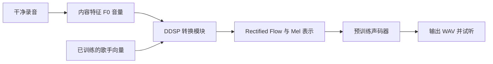

# 从本人录音到声音模型试听

你已跑通云端语言模型训练，这次沿用 JupyterLab 上传、终端运行、读取日志的操作方式。声音模型的输入和输出都是音频：你唱一段，模型转换后输出 WAV，在浏览器播放或下载试听。第一轮使用你的声音学习重合成；有另一位授权歌手的数据后，再训练双音色模型。

## 第一步 准备录音

第一次最好使用干净清唱：一个人唱，无伴奏、无混响效果、无降噪或修音插件，避免音量过大造成爆音。可以保留自然气声、颤音和滑音。普通说话录音能帮助学习声音特征，但要训练歌声音色，仍需你本人的歌唱录音。

先准备三个互相独立的录音组：训练用清唱、验证用另一首或另一次清唱、测试用第三首或第三次清唱。不能先把同一长录音切碎再随机分给三组。优先用不同歌曲并兼顾不同录音场次；更严格的泛化实验要同时留出歌曲和录音场次。

WAV 或 FLAC 最方便；手机 M4A、MP3 可先保留原文件，工具需要 FFmpeg 来读取部分格式。先收集约 5 分钟做接口试跑，后续建议尝试 20–30 分钟清唱，覆盖低、中、高音与不同歌词。这些时长是本教程的起步建议，不是质量保证。

在本机 `voice_lab/recordings/1/` 放入三个文件，示例名字为：

```text
recordings/1/train_songA.wav
recordings/1/val_songB.wav
recordings/1/test_songC.wav
```

如果你的文件名或格式不同，只修改 CSV 中的 path，保持真实文件不变。把 `manifest.example.csv` 复制为 `manifest.csv`，先删除最后一行 stress 示例。第一列 1 表示你本人；group 表示整首歌或录音场次；split 为 train、val 或 test；consent=self 表示本人录音；quality=clean 表示已试听确认无伴奏和明显污染。

含噪声、伴奏和混响的录音可另放 `recordings/stress/`，在 CSV 中标为 split=stress、quality=noisy。它们不会进入首轮训练。若干净与污染版本来自同一首歌或录音，保留为同一个留出测试组，并将两种版本都标为 stress；不要把其中一个用于训练。自动统计无法替你判断是否纯人声，要自己听一遍。

## 第二步 理解术语

| 名称 | 全称或定义 | 在这次实验中的作用 |
|---|---|---|
| SVC | Singing Voice Conversion，歌声音色转换 | 输入已有歌声，改变音色并尽量保留歌词和旋律 |
| SVS | Singing Voice Synthesis，歌声合成 | 从歌词与音符等条件生成歌声，与本轮音频转换的输入不同 |
| PCM | Pulse Code Modulation，脉冲编码调制 | WAV 中保存波形采样值的一种方式 |
| Sampling rate | 采样率，每秒波形采样点数 | 本轮统一 44,100 Hz，8 秒约有 352,800 个采样点 |
| Mono | 单声道 | 一个波形序列；双声道会先平均成单声道 |
| F0 | Fundamental Frequency，基频 | 随时间变化的音高轨迹，有声部分通常对应歌唱音符 |
| ContentVec | 内容表示编码器 | 提取较少包含音色信息的语音内容特征 |
| Embedding | 可学习的数值向量 | 用向量表示歌手身份，双歌手时按 alpha 加权 |
| Mel spectrogram | Mel 频率尺度的时频表示 | 声码器输入，描述每个时间位置的频谱能量 |
| DDSP | Differentiable Digital Signal Processing，可微数字信号处理 | 根据学习到的控制量合成初步波形 |
| Rectified Flow | 整流流生成模型 | 在本底座中生成或改善 Mel 表示 |
| NSF | Neural Source Filter，神经源滤波器 | 声码器中的声源与滤波建模方法 |
| HiFiGAN | High Fidelity Generative Adversarial Network，高保真生成对抗网络 | 从声学表示生成波形的模型家族 |
| Vocoder | 声码器 | 将频谱等表示变成可播放的音频 |
| Batch | 一次更新同时处理的训练片段数 | 默认 2，显存不足时先改为 1 |
| Step | 一次优化器更新 | 首次目标 200 步，后续依据试听和验证再延长 |
| Loss | 损失函数，模型预测与训练目标的差异 | DDSP loss 与 flow loss 分别记录；不能换算成好听百分比 |
| Checkpoint | 模型检查点 | 保存权重、优化器和训练进度的 `.pt` 文件 |
| RTF | Real Time Factor，实时因子 | 处理耗时除以输入音频时长；本工具 cold RTF 包含启动和加载 |
| dBFS | Decibels relative to Full Scale，满幅相对分贝 | 音量测量；削波意味着超过可保存的幅度范围 |
| Cents | 音分，一个半音等于 100 音分 | 测输入与输出音高的差异 |
| SHA256 | Secure Hash Algorithm 256 bit | 文件指纹，用于知道两次是否用了相同数据或模型 |
| Interface | 操作接口 | 训练用终端 CLI，试听用 Jupyter 浏览器音频播放器 |



ContentVec、RMVPE、声码器使用下载的预训练权重；DDSP 与 Flow 转换模块在你的录音上训练。首轮 learning 配置会减小转换模块，以便检查计算路径；参数量以训练输出的 trainable_params 为准。完整模型、更多数据与混合精度是后续明确命名的对照实验。

## 第三步 在本机先检查录音

在 Windows PowerShell 中，从当前项目根目录执行：

```powershell
cd 'I:\sideprojects\ai fundamental'
.\.venv\Scripts\python.exe -m pip install -r voice_lab/requirements-data.txt
cd voice_lab
..\.venv\Scripts\python.exe -m voicelab inventory --recordings recordings --out runs/inventory.json
```

打开 `runs/inventory.json`。每个文件应有时长、采样率、声道数和音量统计；error 表示无法读取。clipped_fraction 明显大于零时要听有无破音，near_silent_fraction 很高时检查长静音；不能仅靠这些数值判断有无伴奏。还没有录音时 inventory 会明确报错，不会生成假的训练数据。

检查完成后，把 `recordings/` 和编辑后的 `manifest.csv` 另打成录音 ZIP。声音工具入门包不含你的录音，也不含大型预训练权重。

## 第四步 准备 AutoDL 环境

继续用 1 张 RTX 4090 24GB、PyTorch 2.8.0、Python 3.12、CUDA 12.8 镜像。这是根据你已有环境安排的单卡试跑方案；本机没有 NVIDIA GPU，尚未验证它在真实录音上的训练速度。原来的语言模型环境和 checkpoint 不参与这个声音实验。

JupyterLab 上传 `voice_lab_autodl_starter.zip`，打开 Terminal。以下命令从 root 用户目录自动查找上传包，并解压到 AutoDL 数据盘；若 `/root/autodl-tmp` 不存在，先根据当前实例的目录说明确定数据盘位置。

```bash
mkdir -p /root/autodl-tmp/voice-lab
unzip "$(find /root -maxdepth 4 -name voice_lab_autodl_starter.zip -print -quit)" -d /root/autodl-tmp/voice-lab
cd /root/autodl-tmp/voice-lab
bash setup_cloud.sh
source .voice-venv/bin/activate
python -m voicelab doctor --require-gpu
```

通过标准：cuda_available=true、gpu 包含 RTX 4090、torchaudio_import=OK。missing_assets 此时列出三个部件的文件是正常的，它们下一步才下载。安装会使用一个单独的声音环境，并记录 `runs/environment.lock.txt`。如果 PyTorch/CUDA 检查、依赖安装或 torchaudio 导入失败，保存完整输出并处理该错误后再继续。

每次新开终端都执行以下两行，终端中的 `~` 只是 root 主目录，不代表你仍在项目里：

```bash
cd /root/autodl-tmp/voice-lab
source .voice-venv/bin/activate
```

## 第五步 上传与切分你的录音

在 JupyterLab 进入 `/root/autodl-tmp/voice-lab/recordings/1/` 上传录音；把 manifest.csv 上传到 `/root/autodl-tmp/voice-lab/`。这些文件的位置必须和 CSV 的 path 对应。首次单歌手只需三条真实记录，更多训练文件可以继续增加行。

```bash
python -m voicelab inventory --recordings recordings --out runs/inventory.json
python -m voicelab prepare --manifest manifest.csv --recordings recordings --out data/self_v1
python -m voicelab config --data data/self_v1 --run-name self_v1 --out configs/self_v1.yaml
```

通过标准：prepare 输出 train/val/test 的片段数与总秒数；config 输出 speakers=1、profile=learning。片段默认 8 秒，末尾不足 3 秒的部分会丢弃，避免上游 2 秒随机裁剪遇到过短输入。全静音片段被跳过；不自动降噪、修音或放大音量。输出目录已有数据时会拒绝覆盖，要选择新版本目录。

得到的文件示例是 `data/self_v1/train/audio/1/<hash>_0000000000.wav`，manifest 记下原录音、分组、切片位置和文件指纹。group 同时出现于不同 split 会报错；同一文件复制改名也会报错。不同编码的同一录音仍需要你正确填写 group 来避免泄漏。

## 第六步 下载部件并提取特征

先阅读 `SOURCES_AND_ROUTE.md`。默认声码器权重限定非商业使用；这次是个人学习路线，不应凭 DDSP 代码的 MIT 标记就声称整条组合可商用。

```bash
python -m voicelab assets
python -m voicelab doctor --require-gpu
python -m voicelab preprocess --config configs/self_v1.yaml --workers 1
```

assets 从指定官方来源下载 ContentVec、RMVPE 和 PC-NSF-HiFiGAN，保存来源和实际 SHA256 到 `runs/assets.json`。首次下载需要网络和磁盘，包本身没有包含这些权重。网络无法连接时保留错误，不用未经核实的第三方模型替代。

preprocess 在固定上游目录执行，输出 F0、volume、units、mel、增广特征等 `.npy`。通过标准是打印 status=preprocessed、feature_files 大于零，并生成 `data/self_v1/features.json`。训练前会核对特征指纹，恢复训练时不允许悄悄换特征。不要使用前面语言模型的 tokens 文件。

## 第七步 跑 200 步并保存证据

```bash
python -m voicelab train --config configs/self_v1.yaml --steps 200 --minutes 15
```

开始时应打印 GPU 名称和实际可训练参数量；随后每 10 步记录 train_loss、ddsp_loss、flow_loss、单步计算耗时和峰值显存。每 100 步执行小规模验证并保存检查点；首次训练还保存 step 0 的未训练转换模型用于前后对照。

成功产物在 `runs/self_v1/`：config.yaml、model_0.pt、model_100.pt、model_200.pt（若达到）、latest.pt、metrics.jsonl、validation.jsonl、scalars.jsonl，以及 summary JSON 和 TensorBoard 的 logs。首轮 fp32、batch=2、2 秒随机训练裁剪；验证每位歌手最多 3 个完整片段。

通过标准：损失为有限数，没有 NaN/Inf，checkpoint 存在，summary 的 status 是 target_reached、final_step=200。若 status=time_limit，表示达到了时间上限，latest.pt 保存当前进度，不代表已经跑满 200 步。OOM（Out Of Memory，显存不足）时先停止，创建一个 batch=1 的新配置和新实验目录；不要把不同配置的日志混为一个实验。

15 分钟上限在训练步之间检查，当前计算、保存或验证可能稍晚结束。它不会自动关闭实例，也不是账单上限。安装、下载、预处理和试听期间实例仍可能计费。

## 第八步 转换和浏览器试听

将 input 替换为你 CSV 中测试录音的实际路径。以下示例用第三首清唱：

```bash
python -m voicelab infer --input recordings/1/test_songC.wav --checkpoint runs/self_v1/model_0.pt --alphas 0 --steps 10 --out runs/self_v1/listen_before
python -m voicelab infer --input recordings/1/test_songC.wav --checkpoint runs/self_v1/latest.pt --alphas 0 --steps 10 --out runs/self_v1/listen_after
```

每个输出目录应有规范化的 input.wav、alpha_0.000.wav、完整运行日志和 inference.json。step 0 的结果可能是无意义噪声，首次试听调低播放器音量。200 步之后也可能很差；要把这些声音当作真实实验结果保留，不能凭损失下降就声称质量改善。

在 JupyterLab 打开 `listen.ipynb`，右上角选择 Voice Lab 内核，按 Shift+Enter 运行单元格。界面是浏览器原生音频播放器，分别播放原始输入、训练前、训练后和后续多个 alpha 的 WAV。也可以右键 WAV 下载回电脑，用耳机试听。

这里的体验是播放转换后的音频，不是与模型文字聊天。首轮只训练一个音色，会重合成你的声音；它没有自动纠正跑调，也没有第二位歌手可供切换。

## 第九步 评估与生成记录

```bash
python -m voicelab evaluate --input runs/self_v1/listen_after/input.wav --converted runs/self_v1/listen_after/alpha_0.000.wav --out runs/self_v1/after_evaluation.json
python -m voicelab report --data data/self_v1 --out runs/REPORT.md
```

评估用 pYIN 对干净单声道歌声估计 F0，报告共同有声帧上的音高音分误差、清浊音不一致比例、时长比例和音量。结果依赖音高估计器及时间对齐；伴奏、双人合唱或输出延迟会影响它。median_abs_pitch_cents 越小，通常表示旋律保持越好，但不代表音色更相似或音质更自然。

人工试听记录用 `listening_scores.example.csv`。给相同测试歌曲的输出随机代号，请听众分别打自然度、本人相似度、目标歌手相似度和歌词清晰度分数；注明听众人数和是否知道标签。至少保留逐文件评分，研究级结果要有多首独立歌曲、多位听众、置信区间和训练种子重复。自评可帮助定位问题，不能当作独立真值。

`runs/REPORT.md` 只从现有记录生成数据与训练结果。更完整的研究报告结构在 `RESEARCH_REPORT.md`；云端未执行前结果栏保持待测。不要把训练前语言模型的速度数字写进声音模型报告。

## 第十步 延长训练与双音色对照

首次接口与试听检查通过后，可以在相同配置与数据下恢复到更高总步数：

```bash
python -m voicelab train --config configs/self_v1.yaml --resume runs/self_v1/latest.pt --steps 2000 --minutes 60
```

steps=2000 是总目标，不是额外增加 2000。恢复会加载模型、优化器和学习率调度；当前实现不保证恢复后的随机采样顺序与不中断训练完全一致，因此不能声称精确逐位恢复。不要同时运行两次训练写入同一目录。

加入第二歌手时，把歌手 2 的授权录音放 `recordings/2/`，增加 speaker_id=2、consent=authorized 的独立 train/val/test 行。两位歌手覆盖接近的音域、风格和干净数据量，有助于控制混杂因素。建立新数据集和新模型，保留第一轮结果：

```bash
python -m voicelab prepare --manifest manifest_duo.csv --recordings recordings --out data/duo_v1
python -m voicelab config --data data/duo_v1 --run-name duo_v1 --out configs/duo_v1.yaml
python -m voicelab preprocess --config configs/duo_v1.yaml --workers 1
python -m voicelab train --config configs/duo_v1.yaml --steps 200 --minutes 15
python -m voicelab infer --input recordings/1/test_songC.wav --checkpoint runs/duo_v1/latest.pt --alphas 0 0.25 0.5 0.75 1 --steps 10 --out runs/duo_v1/alpha_sweep
```

alpha 控制模型中的歌手权重，五个输出采用同一输入、checkpoint、种子和推理步数。0 端是模型重合成的你，1 端是模型重合成的歌手 2；中间位置是否自然、是否单调需要实测。单歌手模型请求 alpha=0.5 会明确报错。

这轮之后，再对相同 checkpoint 做推理步数 10 与 50 的速度和质量对照。修音 beta 需要目标音高与保持颤音的策略，零样本用户插值需要另一个训练分布与编码器；当前工具没有把它们伪装成已经实现的滑杆。

## 费用与结束操作

GPU 费用按实际单价乘以运行小时估算，另计平台展示的磁盘等费用。先根据运行日志测 200 步的耗时，再估算较长训练；不预设固定几小时就能获得好音色。设置平台定时关机可以限制无人看管的运行，仍应先保存与下载结果。

结束时下载 `runs/`、configs、manifest.csv、数据 manifest/features.json 和 sources.json，并保留原始录音。checkpoint 旁边的 config.yaml 及预训练部件用于以后推理。最后在实例页面点击关机。平台的保存和释放规则以 [AutoDL 官方说明](https://www.autodl.com/docs/quick_start/) 为准。
