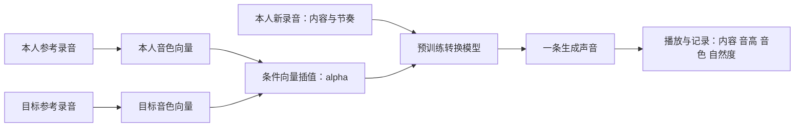

# 声音混合下一轮：先修正失败，再做可录音的体验

日期：2026-10-03。目标是把本人的讲话或轻唱，变成保留本人部分音色、又带有目标歌手音色的声音，并能在网页中录音、转换、试听。

本文件是新的探索与操作计划。旧训练记录、旧模型和旧 WAV 保留。新模型在本人样本上的速度、音质和混合效果，要以本轮实际输出与试听记录补充；本文件不预设质量胜者。

## 1. 先纠正上一轮的结论

你反馈匿名 Y 有“几个音轨叠起来、多声部”的感觉，匿名 X 有“滋滋电流声”。这说明上一轮没有通过你的音质验收。训练完成 1000 步与声音可用，是两件需要分别核验的事。

| 旧标签 | 对应实验 | 当时真正做了什么 | 没有验证什么 |
|---|---|---|---|
| X | A，转换生成器/判别器随机初始化 | 在本人约 311 秒训练录音上更新 1000 次，共享冻结的预训练 HuBERT、RMVPE | 整个系统从零训练、可用自然度、目标歌手转换 |
| Y | B，官方转换生成器/判别器微调 | 同一架构、数据、特征与步数 | Adele 音色、本人和 Adele 的混合、讲话效果 |

**上一轮没有 Adele 数据或 Adele 参考音色。** 只有本人的六段录音。模型配置里的 109 行说话人 embedding，不代表训练了 109 位歌手，更不代表其中包含 Adele。

本机审计已经有这些证据：

- 匿名化只乘了一个增益。X 放大约 **9.32 dB**，Y 降低约 **2.89 dB**；与对应原始输出的波形相关系数都超过 0.99999999，没有发现匿名步骤加入第二条音轨。
- 这个样本为 20 秒，低于当时 65 秒分块门槛，没有长音频多块重叠合成。输出是 40 kHz 单声道 PCM16，无数字削波。
- 两套权重在正确架构下加载，没有缺失或多余推理权重。B 的起始权重与固定官方预训练 G 全部匹配。
- 输入安静帧 RMS 为 **−53.05 dBFS**，A 仍有 **−31.70 dBFS**；A 的停顿与活跃段几乎同响。这支持“滋滋声”的失败反馈。匿名增益又把已有缺陷放大。
- B 的响度节奏较接近原声，但安静帧仍有额外能量。原有基频指标较好，不能证明没有叠音感、拖尾或声码器伪影。

审计找到一个应优先控制实验的问题：固定上游代码在训练和推理时，都把 `F0=0` 的清辅音、气息、停顿帧插值为正基频；NSF 声源又用 `F0>0` 判断是否产生周期激励。需要对比“保留原始零帧”与“全插值”的输出。这是可检验的原因候选，尚未证明是全部伪影的根因。

完整证据见 [质量审计](runs/quality_audit_20261003/QUALITY_AUDIT.md)、[原始审计数据](runs/quality_audit_20261003/AUDIT.json)。

## 2. 先认识这几个术语

| 术语 | 全称 | 新手解释 | 与本轮的关系 |
|---|---|---|---|
| VC | Voice Conversion，声音转换 | 输入已经说好的声音，改变“像谁说的”，尽量保留说了什么和说话节奏 | 网页录音后转换讲话 |
| SVC | Singing Voice Conversion，歌声音色转换 | 输入已经唱好的声音，改变歌手音色，尽量保留歌词、旋律和节奏 | 轻唱转成目标歌手/混合音色 |
| TTS | Text-to-Speech，文本转语音 | 输入文字，由模型重新生成一句话 | 可以作为之后的文字演示；不能替代“转换你的录音”测试 |
| F0 | Fundamental Frequency，基频 | 声带周期振动的主要频率，单位 Hz；主要对应音高，清辅音和停顿往往没有可靠的周期基频 | 清唱要保留旋律；F0 正确仍可能音质不好 |
| GAN | Generative Adversarial Network，生成对抗网络 | 生成器 G 造声音，判别器 D 学着识别真录音和生成声音，两者共同训练 | 上轮 RVC 的部分训练结构；GAN loss 不等于听感分数 |
| embedding | 嵌入向量；这是完整词，不是缩写 | 用一组数字描述模型学到的音色等条件；数字本身不是音频轨道 | 本人、目标各有一个条件向量，再尝试插值 |
| LERP | Linear Interpolation，线性插值 | 两个向量按比例加权，例如 `0.75 × 本人 + 0.25 × 目标` | 最直接的音色条件混合起点 |
| SLERP | Spherical Linear Interpolation，球面线性插值 | 沿向量方向之间的球面路径插值，常用于避免普通线性插值中间向量长度明显缩小 | 可作为 LERP 的对照；不能保证听起来更好 |
| CFG | Classifier-Free Guidance，无分类器引导 | 生成时调整模型对条件的跟随程度；某些模型有内容与相似度条件的不同控制量 | 参数强度不等于“目标歌手占百分之多少” |
| latent | 隐变量/潜在表示 | 模型内部表示内容、风格或音色的数字，不直接让人阅读或播放 | 本轮优先尝试条件内部的混合 |
| zero-shot | 零样本适配 | 为一个新目标音色提供参考录音，不先为这个人训练专用模型 | 先检验预训练底座是否够用，避免直接重复坏训练 |
| CPU / GPU | Central Processing Unit / Graphics Processing Unit，中央处理器/图形处理器 | CPU 是普通计算处理器；GPU 擅长并行计算 | 这轮先本机 CPU，云端测试另记录价格与预算 |
| seed | 随机种子；完整词，不是缩写 | 固定模型随机生成过程的起点 | 比较不同混合比例时固定同一个种子 |
| interface / UI | Interface / User Interface，交互界面/用户界面 | 你操作的网页：录音、上传、调滑杆、点转换和播放 | 不是单纯展示一段已有音频 |

## 3. 你的目标应拆成三个保持与一个变化

一次转换希望保持：

1. **内容**：你说的句子或唱的歌词，不被替换成参考录音的句子。
2. **音高与旋律**：你轻唱的音符、滑音和节奏；不是把目标参考的旋律照搬过来。
3. **时序**：你的停顿、音节先后与主要时长。

希望变化的是：

4. **音色条件**：从本人方向逐步接近目标参考音色。

唱法、气声、情绪、口音和音色会有耦合。用目标参考声音，不代表只会改变音色；模型可能连风格或节奏一起改变，因此每个维度都需要试听。



示意公式是：

```python
# alpha 是模型条件权重，不能当作已校准的听感百分比。
mixed_embedding = (1 - alpha) * self_embedding + alpha * target_embedding
```

如果直接 `输出 = 原声 × 0.5 + 转换声 × 0.5`，两条声音可能有时延、相位和音高细节差异，容易形成双人合唱、梳状滤波或叠音。这种波形效果可以单独研究，但本轮的音色混合实验应明确采用哪一种机制，不能把叠两条音轨展示成已验证的音色插值。

## 4. 新的开源模型路线

这里的“优先”是按任务匹配和可控制接口排序，**不是已经在你声音上测出的质量排名**。

| 路线 | 优先测试的用途 | 本轮怎样使用 | 仍要测什么 |
|---|---|---|---|
| OpenVoice V2 | 讲话转换、可解释的音色条件混合 | 本机 CPU，先提取本人/目标 embedding，再调用音色转换器；用五档插值做机制验证 | 中文可懂度、本人重建误差、目标相似度、CPU 延迟；轻唱效果另测 |
| SoulX-Singer-SVC | 清唱转换 | 下一步清唱优先候选：输入清唱及参考声音，保留源内容与旋律 | 本人样本是否减少滋滋、叠音/拖尾；再检查如何实现条件混合 |
| Seed-VC v1 | 另一种底座的交叉验证 | 分开跑讲话 VC 与开启 F0 条件的 SVC，在相同测试录音上对比 | 实际自然度、音高保留、耗时；CFG 参数不是天然的音色百分比滑杆 |
| 旧 RVC B | 诊断对照 | 保留 step0/500/1000，测试 F0 零帧消融 | 缺陷是否来自预训练、微调或前处理 |

OpenVoice 官方 API 有独立的 `src_se` 和 `tgt_se` 音色条件，支持参考 embedding 提取；CPU 设备也是可选择的。本项目已经实现条件插值并生成真实输出，其音质和身份变化方向仍待试听评估；官方没有保证“本人和 Adele 百分比”。[OpenVoice 转换 API](https://github.com/myshell-ai/OpenVoice/blob/main/openvoice/api.py#L126)，[官方项目与 V2 说明](https://github.com/myshell-ai/OpenVoice)。

SoulX-Singer-SVC 官方提供音频到音频的歌声转换入口和 `webui_svc.py`，可在不逐人微调的情况下使用参考音色；本轮优先测试其 SVC 分支，不能把需要歌词/乐谱的 SVS 分支和它混为一谈。这里尚未完成本人录音的推理对照。[SoulX-Singer 官方说明](https://github.com/Soul-AILab/SoulX-Singer)。

Seed-VC 官方区分讲话与歌声模型，v1 推理有 `f0-condition`、时长与 CFG 等参数。用它作为独立底座，才能检验换模型是否改善同一输入的失败现象。作者网页样例和参数说明不等于本机性能或你录音的效果。[Seed-VC 官方说明](https://github.com/Plachtaa/seed-vc)。

## 5. 参考音库：先确认目标身份

| 来源 | 当前身份与用途 | 本轮安排 |
|---|---|---|
| 本人六段清唱 | 只有本人音色；清唱数据不能覆盖讲话验证 | 已有 8 秒留出清唱片段和约 9.41 秒本人参考，可做重建与机制检查 |
| LJ Speech | 录音者是 **Linda Johnson**，数据页声明 Public Domain | 开放的讲话参考基线，检验是否发生参考音色变化；不能标成 Adele |
| GTSinger | 多语言歌声研究数据，CC BY-NC-SA 4.0 | 仅安排在本轮非商业个人研究用途；不据此建立商用音库 |
| Adele 目标参考 | 本轮没有找到可直接作为开放授权 Adele 音库的明确来源；现在也没有导入该目标录音 | 需要你选定一个实际目标片段，才能测“本人 ↔ Adele 参考”的方向 |

LJ Speech 的说话人和许可来自 [官方数据页](https://keithito.com/LJ-Speech-Dataset/)。GTSinger 的非商业与署名/相同方式共享条款见 [官方许可](https://github.com/AaronZ345/GTSinger/blob/main/dataset_license.md)。

已下载的 LJ 基线在 `voice_workbench/assets/ljspeech_reference.wav`，实际时长 **7.5839 秒**、采样率 **22,050 Hz**，不是 Adele，也不是歌声参考。来源与 SHA256 已记录于旁边的 `LJ_REFERENCE_RECEIPT.json`。这段数据足够作为第一轮机制测试，不应冒充目标歌手效果。

## 6. 你需要准备哪些文件

### 6.1 本人讲话输入：5–15 秒

在安静房间离麦克风约一掌距离，正常音量说一段话。建议用同一句方便多次比较，例如：

> 今天我想测试声音转换。我会先说一句话，再停顿一下，然后轻声说完这一段。

文字只是建议，不要求逐字照读。故意保留一句中的短停顿，可以检查转换声是否在你停下来后还继续嗡嗡响。不要加混响、伴奏、修音或背景音乐。先用网页录音；已有文件也可以上传，界面接受哪些格式以实际入口说明为准。

**操作后得到：** 一段能正常播放、听得清你在说什么的输入录音。先试听原声，再转换。当前现有资料只有清唱，**尚没有新采集讲话录音**，所以不能提前宣称讲话效果通过。

### 6.2 本人轻唱输入：5–15 秒

唱几句简单旋律，加入一小段停顿，避免第一轮选极高音、强喊或同时播放伴奏。保持近似相同的麦克风距离。唱自己熟悉的短旋律即可，没必要跟目标歌手唱同一首歌。

**操作后得到：** 一段清楚的单人轻唱。后续所有模型处理同一份 WAV，不能每个模型重新录一次再比较。

### 6.3 本人参考：约 10–30 秒

参考声音用于告诉模型“本人音色是什么”。可以用独立一段干净讲话；轻唱路线另用独立清唱参考。它不需要与输入说相同内容，最好与评估输入分开。

### 6.4 目标参考：约 10–30 秒

给一个目标歌手声音片段，最好是单独的人声，没有重伴奏、多人和声或很强混响。讲话演示最好先配讲话参考，歌唱演示先配清唱参考；跨讲话与歌唱参考可以之后单独作为对照。

你希望是 Adele 方向，就提供自己选定的那个目标片段或可取得的明确文件。无需先准备几十分钟音库来做第一轮零样本验证。10–30 秒是本轮建议，实际模型要求以固定版本输入检查为准。

**如果只有成品歌曲：** 先保留原片段，再做一次人声分离；对比原片段和分离后人声的伴奏/和声残留，不能把“分离输出是 WAV”当作已经得到干净单人参考。参考中的和声、残响也可能被模型学成你听到的多声部感。

## 7. 每一步怎么做、怎么看结果

### 第一步：打开交互入口

本轮交互服务的地址约定为 **http://127.0.0.1:8872/**。它是你这台电脑的本地地址，服务启动后才能访问；其他人的电脑访问同一个数字，不会访问到你的模型。

本机环境已经准备好，入口已通过真实上传与推理验证。如服务未运行，在 PowerShell 执行：

```powershell
Set-Location -LiteralPath 'I:\sideprojects\ai fundamental\voice_lab\voice_workbench'
.\.venv\Scripts\python.exe -X utf8 app.py
```

同目录已有 `start_workbench.ps1` 启动脚本。保持服务窗口打开；Ctrl+C 可停止服务。在另一台电脑上先按工作台 README 安装依赖与模型，再启动。

**你应看到：** 浏览器页面能显示录音/上传输入、目标参考、音色比例、转换动作和试听控件。模型未加载或音频有问题时应显示明确状态，不应播放一个预先存好的样例冒充刚才的转换结果。

### 第二步：通过原声检查

1. 录 5–15 秒讲话或上传轻唱文件。
2. 停止录音，单独点“原声”的播放按钮。
3. 确认内容清楚、无叠音、没有削波；记录明显噪声和停顿时间。

**通过条件：** 原声本来就清楚，才能把转换后的新增缺陷归因到处理链。原声检查失败，就先换麦克风距离或清理参考，不进入混合评估。

### 第三步：本人到本人重建

先用本人参考音色作为输出条件，让模型重新生成你这句话。

**你应比较：** 原声与“模型本人重建”是否同样可懂；停顿是否安静；轻唱旋律是否跑掉；有无突然滋滋、双音、拖尾。

**通过条件：** 模型本人重建没有不可接受的新增缺陷。否则先修模型/输入/前处理，不把后续目标混合展示成已完成体验。

### 第四步：目标音色纯转换

换为目标参考，让 `alpha=100%` 先生成一条目标转换输出。保持相同输入、随机种子与其他参数。

**通过条件：** 你说的话、唱的旋律与节奏大体保留，且能听到目标音色方向的变化。听到参考录音的歌词被复制出来、旋律被替换、明显双人合唱或很强滋滋，都要标失败。

### 第五步：五档音色条件扫描

固定同一输入、参考、模型、推理参数和随机种子，输出这五档：

| alpha | 条件向量权重 | 你要听什么 |
|---|---|---|
| 0% | 本人端 | 与本人重建一致性、有没有最低程度的模型伪影 |
| 25% | 75% 本人条件 + 25% 目标条件 | 有无轻微、可理解的音色方向变化 |
| 50% | 两端条件各一半 | 中间向量是否自然，有无突然恶化 |
| 75% | 25% 本人条件 + 75% 目标条件 | 是否继续接近目标，同时保留内容和旋律 |
| 100% | 目标端 | 与纯目标转换是否一致 |

这不是“人的听觉确认包含 50% Adele”。**alpha 只定义模型条件权重**；某些中间值可能不自然，变化也未必单调。先测 LERP，再把 SLERP 作为独立对照，不能同时更换模型、参考、种子和混合算法。

### 第六步：区分两种 0%

- **原声旁路 0%**：直接返回原始录音，不经过模型。它可以作为产品中的可靠“保留本人”端点，输出应与输入一致。
- **模型重建 0%**：经过模型，以本人的条件向量重新合成。它会暴露模型自身误差，不能用原声旁路替换后宣称重建没有缺陷。

研究扫描要保留模型重建 0%；交互产品可明确提供原声旁路。两个结果各有作用，界面应让你知道现在播放的是哪一个。

### 第七步：一次只播放一个控件

点任意播放器时，其它播放器应自动暂停。录音预览、目标参考、原声和输出不能同时继续播放，否则真的会听到多个声部，难以判断是模型问题还是网页音频叠放。此项作为 UI 验收要求，需通过实际点击验证。

### 第八步：保存本次证据

每次转换至少留下：输入文件、本人/目标参考文件的 SHA256、模型版本/权重哈希、alpha、插值算法、seed、推理精度、耗时、输出 WAV，以及你记录的失败时间点。

试听记录建议包含四栏：**自然度、可懂度、音色方向、音高/节奏稳定性**，各用 1–5 分并写一句具体观察。不得用 GAN loss、一个 F0 数字或模型自己的评价替代你的听感。

## 8. 四个质量检查点

| 检查点 | 最小对照 | 没通过时的下一步 |
|---|---|---|
| 输入清楚 | 只播原声与参考 | 改录音、检查和声/混响残留，保留失败样本 |
| 本人重建可用 | 原声 vs 模型本人重建 | 看停顿、F0 零帧、推理精度与快照，不进入混合展示 |
| 纯目标转换可用 | 同一输入，本人重建 vs 目标转换 | 更换参考或底座，记录哪一维退化 |
| 中间比例可用 | 固定参数五档 alpha | 比较 LERP/SLERP，限制到实测自然的范围，不保证所有比例好听 |

每个检查点都要分别测试讲话和轻唱。当前已有清唱留出片段，能够先做轻唱诊断；缺少讲话输入与 Adele 参考时，仍可以搭录音入口、做开放参考基线和本人重建，但对应目标结果保持待测。

## 9. “录音后转换”与“边说边变声”的区别

第一版流程是：**录音 → 停止 → 点击转换 → 等待 → 播放**。这个版本可以清晰评估一句话，不需要先解决连续流式缓存和反馈回声。

边说边听到转换声属于流式 VC。它还要处理每块音频时长、重叠接缝、模型预热、耳机回声、网络时延和计算速度。预训练模型有实时演示，不代表你的 CPU、参考条件混合或网络部署已经满足实时。

后续报告至少分别记录：首次模型加载时间、加载后每段转换时间、输入时长。计算 `RTF = 转换耗时 / 输入时长`；RTF < 1 表示算得比录音时长快，但仍不等于麦克风到耳机的实际端到端延迟达标。

## 10. GitHub 展示、你电脑运行、云端运行

| 位置 | 能做什么 | 怎样访问 |
|---|---|---|
| [现有 GitHub Pages](https://djdeborah.github.io/ai-fundamental/) | 静态播放已经生成的音频、看报告和图 | 直接用浏览器链接 |
| 本机服务 | 使用你电脑的 CPU 和模型，录音/上传后实际推理 | 服务运行时打开 `http://127.0.0.1:8872/` |
| 后续云端服务 | 使用云端 CPU/GPU 推理，同一交互入口 | 模型服务启动后，用 SSH 转发连接 |

GitHub Pages 本身不能替你执行 Python 模型。若要从别处录音并立即转换，需要连到真实推理后端；静态网页中已有播放器可继续正常展示。

后续云端接口可以绑定在服务器自己的 `127.0.0.1:8872`，本机用正常 SSH 登录做端口转发，命令结构是：

```powershell
ssh -N -L 8872:127.0.0.1:8872 -p <SSH端口> root@<SSH主机>
```

把两个占位符换成当前实例的端口和主机，然后在本机打开相同的本地网址。不要把密码写进命令、代码或 GitHub。只有转发连接和云端服务都在运行，页面才能处理新录音。

**当前安排：本机 CPU 探索，不新租算力。** 上轮定时训练不再继续。新云端模型推理、微调或训练，要明确实际实例价格、剩余预算与目标参考后再启动；此前的两小时窗口已经结束，不能自动当作新的训练授权。

## 11. 实测补充区

状态截至本文编写时：

| 项目 | 状态 |
|---|---|
| 上轮 X/Y 代码、波形与权重审计 | 已完成，原始输出未修改 |
| 新的开放讲话参考 LJ Speech | 已下载并记录来源/哈希，身份为 Linda Johnson |
| 本人轻唱测试 8 秒 / 独立参考约 9.41 秒 | 已准备；文件名中的“10s”不代表实际足 10 秒 |
| OpenVoice V2 CPU 交互与条件插值 | 五档真实输出完成；运行/数值检查通过，音质待用户验收 |
| 本人新讲话录音 | 尚未采集 |
| Adele 实际目标参考 | 尚未提供 |
| SoulX-Singer-SVC / Seed-VC 本人录音对照 | 计划候选，尚无本轮性能或音质结论 |
| alpha 五档的自然度与变化方向 | 已实际输出，人工试听与身份单调性待测 |
| CPU 转换耗时与网页独占播放 | 耗时已记录；实际点击核验新播放暂停上一条 |

后续实测请追加样本路径、模型版本、输出哈希、耗时、试听反馈与失败点。保留未通过的结果，才能看出改善来自哪里。


## 12. 本轮真实 CPU 小样与界面验收

使用固定官方 OpenVoice V2 预训练 converter，在新的本机隔离环境中推理。没有启动付费 GPU 任务，也没有新增训练。远程实例自身开机期间的计费仍以平台为准，不能把本机 CPU 无租赁任务说成整个账户没有消费。

- 输入：同一留出清唱前 8 秒，独立本人参考约 9.41 秒。
- 目标：Linda Johnson / LJ Speech 官方公共领域讲话参考，7.584 秒；不是 Adele，也不是目标清唱参考。
- 条件：LERP，seed=1234，CPU / Torch 2.4.1+cpu，四线程，实际输出采样率22050Hz。
- 五条模型 WAV 均为实际推理，时长约7.99927秒，波形有限、无数字削波；FLOAT WAV 保留模型原始输出。
- 模型本人重建与alpha=0原声旁路分别保存/核验。

| 条件 | 总耗时 / 秒 | 模型转换 / 秒 | 输出 / 秒 | 原声安静帧输出RMS / dBFS | 包络相关 |
|---|---:|---:|---:|---:|---:|
| 本人模型重建 | 18.37 | 8.98 | 7.9993 | -60.06 | 0.958 |
| 25% LERP | 6.57 | 6.17 | 7.9993 | -64.03 | 0.957 |
| 50% LERP | 5.76 | 5.51 | 7.9993 | -67.31 | 0.949 |
| 75% LERP | 6.45 | 6.16 | 7.9993 | -68.12 | 0.946 |
| 100% LERP | 8.07 | 7.79 | 7.9993 | -66.45 | 0.936 |

总耗时包含这批流程的音色提取/文件处理；第一条包括模型加载。更早首次依赖预热的2秒讲话自重建smoke总耗时34.35秒，不能把本批已缓存部分库预热的18.37秒当全新安装后的首段保证。上述每个条件只跑一次，不能当严格速度排名，也不能当边说边变声端到端延迟。

统一裁到同一8秒并重采样22050Hz后：原声安静帧 −54.61dBFS，旧RVC A −32.18，旧RVC B −40.48，新模型本人重建 −60.06。安静帧能量相对整段能量分别为 −24.69、+0.47、−20.66、−28.59dB，可看出改善不是仅用整体增益压低响度。这仍是未做合成时延校准的停顿代理，不证明自然度、歌手身份或无双声部。原20秒审计与此8秒数值不能直接混成同一表。

实际验收过两条路径：

1. HTTP上传 → FFmpeg格式规范化 → alpha=0旁路 → 下载；规范化输入/输出SHA256相同。
2. 上传或网页“载入现有8秒清唱” → 真实模型转换 → WAV播放器/下载与JSON收据；状态200，模型输出实际7.99927秒。浏览器输入、目标参考、输出及六条预生成小样均能载入，readyState=4、error=null。

通过浏览器正常点击参考播放器再点击输入播放器，观察到前者paused=true、后者paused=false；这是独占播放检查，不能宣称修复了原WAV质量。浏览器麦克风按钮与30秒停止逻辑已实现；没有替用户录制讲话，没有验证用户麦克风硬件。

**现在体验：**本机服务运行时打开 http://127.0.0.1:8872/ ，点击“载入现有8秒清唱”或自行录音，选参考，生成并试听。开源模型缓存已在本机准备好。其它电脑按 [工作台安装与操作](voice_workbench/README.md) 准备；[在线预生成小样](https://djdeborah.github.io/ai-fundamental/next-voice/) 只播放现有WAV，不能执行模型。

证据：本机 `voice_workbench/benchmarks/BENCHMARK_RECEIPT.json`、`SAME_CLIP_COMPARISON.json`、`UI_API_VERIFICATION.json`；每条模型WAV旁有原始metadata。公开副本见 [OpenVoice 实测摘要与输出哈希](runs/quality_audit_20261003/OPENVOICE_BENCHMARK.json)，不包含私人交互会话录音。完整模型与参考哈希在准备收据。新的Adele目标和新讲话验收仍待输入，SoulX/Seed歌声对照仍未运行，不能宣布最终方案完成。
