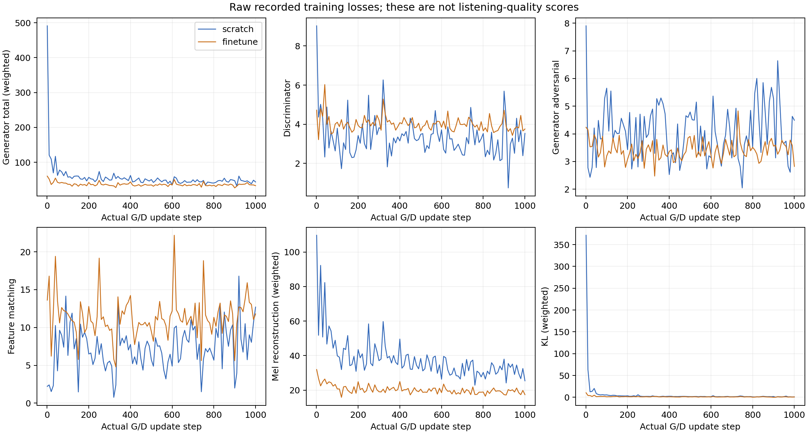

# 本人清唱 RVC：随机初始化与预训练微调的受控小数据实验

## 摘要

本实验比较相同 RVC v2 40 kHz 架构的两种转换模型初始化：A 的生成器和判别器随机初始化；B 加载固定官方预训练生成器和判别器。两组共用冻结的预训练 HuBERT 内容编码器、RMVPE 音高提取器和完全相同的训练特征。输入为一位参与者的六段清唱/练声，原始总时长约 379 秒。按完整录音划分，训练 311.38 秒、验证 33.64 秒、测试 34.24 秒；固定测试录音的前 20 秒用于推理和评价。

**实际相同步数完成：True。** 本报告记录真实训练、模型、音频和客观音高测量；尚未收集盲听评分，因此没有音质胜者结论。这是按科研报告结构组织的学习试验，证据规模尚不足以支持 NeurIPS 级别的研究贡献或统计结论。

## 1. 研究问题与比较边界

问题：在同一个人的约五分钟训练人声、同样本轮更新预算下，预训练 G/D 初始化与随机 G/D 初始化产生怎样的训练轨迹及未见录音重建结果？

本实验没有比较两种方法的总生命周期算力。B 使用了额外公开预训练，其数据规模、组成及训练成本没有在本实验复现。A 的 HuBERT、RMVPE 同样来自预训练，所以 A 只能称为“转换 G/D 随机初始化训练”。当前任务是歌声音色转换（audio → audio），输出保留输入内容与旋律；它不提供文字对话或从文字生成歌声的能力。

## 2. 数据与防泄漏

| 分组 | 原录音尾号 | 时长 | 本次用途 |
|---|---|---:|---|
| 训练 | 1234、19、57、93 | 311.38 秒 | 仅这里的切片进入 G/D 优化 |
| 验证 | 63 | 33.64 秒 | 保留；本轮固定更新步数，没有用它选模型 |
| 测试 | 92 | 34.24 秒 | 固定前 20 秒；不参与更新或模型选择 |

用户确认六个文件为不同歌曲或独立练声。原 M4A 保持原样；预先转换为 40 kHz、单声道、PCM16 WAV，并保存逐文件 SHA256。完整录音分组后，仅对 train 进行上游高通、静音切片和归一化。共同提取了 62 个切片的特征；上游相同的长度分桶会排除不适合训练的短片段。两个模型各 epoch 有 17 个 batch，batch=4；桶内补齐可能重复采样片段，不能把每步四片段解释为四段全新录音。

## 3. 方法与可复现控制

| 项目 | 设置 |
|---|---|
| 架构 | RVC v2、40 kHz、F0 enabled |
| G / D 参数量 | 36,458,818 / 71,410,594 |
| 内容特征 / 音高 | 冻结 HuBERT / 冻结 RMVPE，共用同一份提取结果 |
| 本轮优化 | AdamW；初始学习率 0.0001；seed=1234；batch=4；FP32 |
| 一步的定义 | 对同一个 batch，完成一次 D optimizer update 和一次 G optimizer update |
| 推理 | 移调 0、检索 index rate=0、RMS mix=1、protect=0.33、seed=1234 |
| 运行时 | NVIDIA GeForce RTX 4090 D；Torch 2.8.0+cu128；CUDA runtime 12.8 |
| 中间产物 | 0、500、1000 步推理权重；原始损失、配置、哈希、训练失败证据 |

原始损失在上游显示截断之前记录。生成器总目标包括对抗项、判别器特征匹配项、加权 mel 重建项和 KL 项；判别器目标用于区分真实与生成片段。其数值受判别器状态与各项权重影响，**不能以 A/B 总 loss 大小排序听感**。本实验固定 FP32，防止混合精度缩放器跳过更新导致“步数相同、实际更新不同”。没有承诺 GPU 逐位确定性。

## 4. 实测训练结果

| 组别 | 真实 G/D 更新步数 | 状态 | 含初始化/保存时间（秒） | 峰值框架分配显存（GiB） |
|---|---:|---|---:|---:|
| A：随机 G/D | 1000 | complete | 320.70 | 5.011 |
| B：预训练 G/D 微调 | 1000 | complete | 313.83 | 5.031 |

显存为 `torch.cuda.max_memory_allocated()`，只统计 PyTorch 分配峰值，不能等同于整卡 `nvidia-smi` 总显存。曲线点通常每 10 步记录一次，第 1 步和停止点额外记录；没有把未记录步骤插值成实测值。

## 5. 固定测试重建与客观音高结果

用 librosa pYIN 分别估计原声与输出的 F0：22,050 Hz、frame length=2048、hop=256、范围 50–1100 Hz。逐帧比较假设时间对齐，仅在双方同时判为有声的帧上计算音高误差。

| 组别 | 输出/输入时长比 | 同时有声帧数 | 音高绝对误差中位数（cent） | 超过 50 cent 的比例 | 有声/无声不一致率 |
|---|---:|---:|---:|---:|---:|
| A | 0.999 | 423 | 3050.000 | 100.000% | 50.378% |
| B | 0.999 | 921 | 0.000 | 2.389% | 8.483% |

cent 为音分，1200 cent 等于一个八度，100 cent 为平均律半音。计算为 `1200 × abs(log2(F0_output/F0_input))`。同时有声帧较少会形成选择偏差；低误差并不能证明整段输出好听。pYIN 对带气声、伪影和非周期声音的结果也可能不可靠。以上指标不能直接衡量歌词清晰度、自然度或是否像本人；本实验没有把波形重建距离当成音色相似度。

- scratch：冷启动进程 10.85 秒，包括加载模型和预处理。
- finetune：冷启动进程 8.81 秒，包括加载模型和预处理。

这不是实时推理延迟或多卡加速测量。原音频、A/B 未匹配响度输出，以及独立 RMS 匹配/峰值限制的匿名 X/Y 都已保存；匿名版本的响度处理不会改动原始输出。若某组达到峰值限制，匹配后 RMS 可能仍有差异，试听需结合音频统计。

本段实测中，A 的音高误差中位数为 3050 cent，双方同时有声仅 423 帧，有声/无声不一致约 50.38%；B 分别为 0 cent、921 帧和约 8.48%，超过 50 cent 的比例约 2.39%。这些结果支持“本片段上 B 的估计音高保留更好”，并显示 A 尚未稳定重建该片段音高。pYIN 的默认音高网格有离散分辨率，0 cent 中位数不代表真实声学误差完全为零。单段结果也不能区分“随机初始化需要更多更新”与更广泛的初始化优势；需要独立训练预算和更多录音检验。

## 6. 盲听方案与当前结论

先听原声，再随机顺序听 X/Y。在 `listening_scores.csv` 填写自然度、歌词清晰度、像不像本人、音高稳定性（1–5）及具体问题；完成后查看 `blind_key.json`。当前没有用户评分，不宣称 A 或 B 音质更好。个人评分只能反映本人的体验；正式研究还需要多个听者、更多未见歌曲、多个随机种子及录音级置信区间。

## 7. 失败、修复与费用

旧实例前两轮在更新前失败，分别为直接执行脚本造成包名遮蔽、共享目录未建立；自己的 wrapper 改为模块启动并先创建目录。旧第三轮日志未取回，实际状态仍未知。新实例重装后，62 个特征中一段 29 帧短尾被自己任意的 32 帧门槛误拒；数组全部有限。修为非空且有限，保留上游公共分桶，保存失败输出与修复前后哈希，两组都从 0 步重新开始。本报告的结果全部来自新实例这次共同环境。

新机单价由用户确认为 1.88 元/小时，允许最多两小时，原本轮截止为北京时间 2026-10-03 01:54:41。预算保护基线最初 25 元，重跑累计到 25.6243 元；该基线是涵盖未核实旧费用的保守上界，**不是已花账单**。取回时保护累计上界约 26.102 元，仍限累计 50 元并留 5 元缓冲。实际平台账单与旧机状态未核实。结果 ZIP 中预算为下载前估算；`billing_at_download.json` 包含下载窗口上界，关机后最终预算仍在云端单独记录。自动关机时整包下载中断；已从部分 ZIP 的完整条目恢复 56 个文件并逐项校验 CRC，最终模型及 WAV 另与声明的 SHA256 核对。B 的 step1000 从哈希相同的最终 model.pth 复制恢复，见 `PARTIAL_RECOVERY_RECEIPT.json`。整份云端 ZIP 尚未完整取回或核验；末段的失败日志归档仍保留云端，等待无卡模式补取。

## 8. 有限结论与下一轮

本轮支持判断训练流程能否运行、固定更新预算能否完成，以及这段未见录音的重建特征。它不能验证另一位歌者转换成你的音色、任意用户零样本转换、可校准的音色比例滑杆、实时性能或商用产品质量。验证集未用于挑选 checkpoint；本轮只有一个种子和一个测试录音，没有统计显著性结论。

下一轮有区分度的实验依次为：收集一位获授权歌者的未训练清唱进行跨歌者转换；扩大本人不同音域和唱法的数据；至少三个种子、多个整首歌分组的测试；完成匿名听评。每个扩展先单独确定数据、预算和指标，不把这些尚未做的实验写成结果。

## 9. 证据索引与固定来源

- `corpus.json`：完整录音划分与数据哈希；`features.json`：共同特征哈希。
- `scratch/`、`finetune/`：start、summary、metrics、0/500/1000 快照及最终 model。
- `instrumentation.json`：自己的运行时插桩；上游文件保持原值。
- `FEATURE_VALIDATION_PATCH.json`、`NEW_INSTANCE_RETRY1.json`：短尾修复与续跑收据。
- `listening/`、`blind/`：原声、原始转换输出、匿名输出；音高指标保留在 JSON。
- `environment.json`、`assets.json`、下载和预算记录：环境、公共资产来源与费用边界。

[RVC 固定源码与 CLI](https://github.com/RVC-Project/Retrieval-based-Voice-Conversion-WebUI/blob/81eed5e8f68b6bed1789f682fe78cdd324495afc/docs/en/cli.md)；[固定公共资产](https://huggingface.co/lj1995/VoiceConversionWebUI/tree/e6d0c1a17da07c33557852f9dfa2bd44cc75737d)。这些是本次实际使用版本，商用许可仍需分别核验代码、权重、数据。
