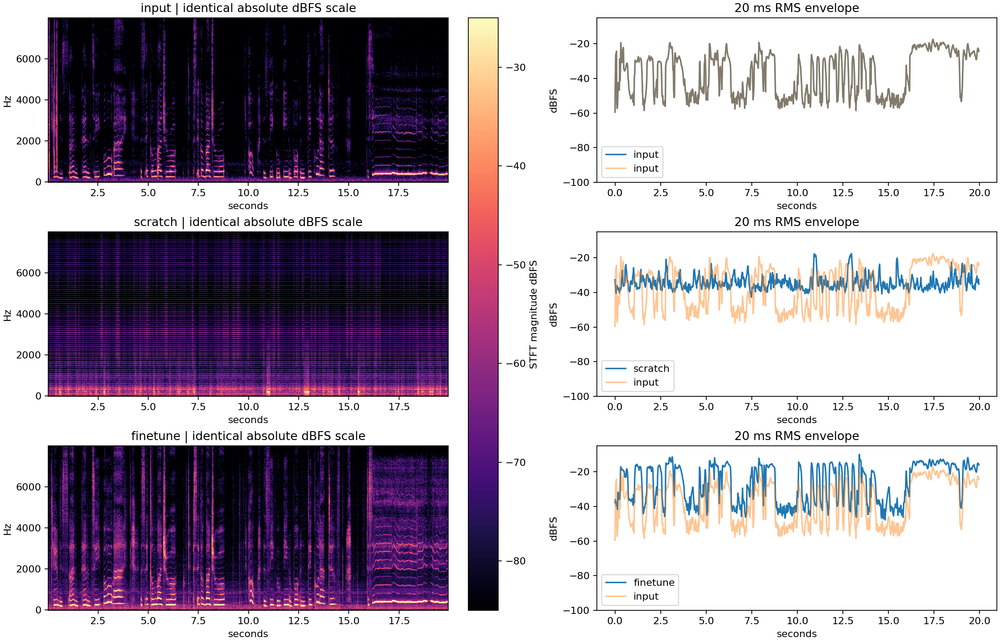

# 上轮 RVC 音质问题：代码、波形与权重审计

本次只读取已有文件，没有重新训练、推理或修改原始 WAV。没有声称完成主观试听。用户提供的听感观察为：X 滋滋电流声，Y 像多声部叠音。这些观察应视为需要排查的真实失败反馈。

## 已确认的对应关系

- X：转换生成器/判别器随机初始化的 A 组，1000 次更新。
- Y：官方预训练转换生成器/判别器微调的 B 组，1000 次更新。
- 两组仅有本人的训练录音，没有 Adele 的训练数据；109 行说话人嵌入是架构配置，不能解释为训练了 109 个目标歌手。

## 已排除或缩小的问题

1. **匿名化没有叠轨。** X、Y 与对应原始输出的相关系数均大于 0.99999999。分别用单个增益拟合后，残差 RMS 约 -95 dBFS，接近 PCM16 量化误差。X 增益为 +9.32 dB，Y 为 -2.89 dB。匿名化只改变幅度，X 的已有缺陷因此被放大。
2. **本次没有多段波形重叠相加。** 输入是 20 秒，4090 D / FP16 的分块门槛为 65 秒。该样本走单段合成。上游长音频分段也使用 `np.concatenate` 拼接，未找到原声与转换声音相加的路径。`rms_mix_rate=1` 跳过响度包络匹配；这个参数本身也不是两个歌手的音色混合。
3. **不是 WAV 头标注成错误采样率。** 五个 WAV 都是单声道 40,000 Hz、PCM16；原声 20 秒，转换结果 19.98 秒。20 毫秒的差异符合特征帧长度裁切量级，不是 44.1/48/40 kHz 混用产生的整体变调。
4. **没有发现模型架构/导出键缺失。** 两个最终模型都按相同 `SynthesizerTrnMs768NSFsid`、v2、F0、40k 实例化加载，457 个导出张量全部有限，缺失/多余推理权重键均为 0。B 的 step0 全部 457 个导出张量与官方预训练 G 转为 FP16 后完全相同；两组最终模型全部 457 个张量均已发生更新。
5. **没有数字削波。** 三个原始 WAV 的样本绝对值均未达到 0.99。单声道不能单独排除音频内部已包含多声部，但代码检查没有发现包装器添加第二条轨道。

## 波形直接证据

用输入原声 RMS 第 95 百分位以下 30 dB 的 20 毫秒帧作为“原声安静帧”诊断代理，共 240/999 帧。该代理不是专门的语音活动检测器，也会受到合成时延影响。

| 项目 | 原声 | A / X 对应原输出 | B / Y 对应原输出 |
|---|---:|---:|---:|
| 安静帧 RMS / dBFS | -53.05 | -31.70 | -39.96 |
| 活跃帧 RMS / dBFS | -26.29 | -31.13 | -17.86 |
| 与原声 20 ms 响度包络相关系数 | 1.000 | -0.119 | 0.902 |

**A 的输出几乎不随原声的停顿变弱。** 图上可以看到原声停顿时仍有连续条纹和能量。这与“滋滋声”反馈一致，是输出没有学好重建的直接数值证据。不能据此把具体噪声来源断言为电源干扰；“电流声”是听感描述。

**B 保留了较多响度节奏，但安静帧仍有额外能量。** 这不能证明有第二个歌手，也不能证明听感自然。原有 pYIN 基频指标对 B 较好，只说明这一片段的估计基频保留，无法检测声码器拖尾、相位、共振或多声部感。

## 优先可检验的原因候选

### 1. 固定上游实现删除了原始清浊音掩码

`train/dataset/extract_f0.py:102` 与 `infer/vc/pipeline.py:126` 都把全部 `F0==0` 帧插值成相邻浊音的正基频，包括清辅音、气息、停顿。`infer/module/models.py:303` 的 NSF 正弦声源以 `F0>0` 判定浊音，且明确约定无声帧应为 0。因此插值可能让原本无周期声源的地方得到周期激励。训练和推理都这样处理，不是单纯训练/推理内部不一致；仍可能与官方预训练声源习惯不一致。

这是**具体、可检验的原因候选**，尚未通过控制推理实验证明它就是 Y 叠音感或 X 噪声的唯一根因。不要只延长训练后就宣称已修复。

### 2. 随机初始化组的学习规模不足以作为可用品质

A 在约 311 秒训练音频上只做了 1000 次更新。它完成了实验协议，但停顿能量和原有估计基频失败表明，它没有达到可用声音重建。完成更新数不是音质验收。B 可作为改进起点，不能沿用“训练完成=效果达标”。

### 3. 录音残响 / 声码器拖尾 / 随机合成

原始录音之前只数值检查了削波，没有完成伴奏、混响和是否重复音轨的主观审查。RVC 合成还包含随机 latent 噪声，已有推理固定 seed=1234；应以相同 seed 对照单个因素，再试其他 seed 查看缺陷是否稳定。不能用单一 pYIN 结果代替这些检查。

### 4. 参数名容易产生误解

本次 `index_rate=0` 禁用了训练特征检索，没有测过 index 对身份和伪影的作用。`protect=0.33` 在未检索时混合的是相同的 HuBERT 特征；F0 全插值还消除了其清浊音低值掩码。它并不等同于“已保护清辅音”。FP32 是训练批次数学精度；上游导出权重和这次推理都是 FP16，不能把整条链说成 FP32。

## 建议先做的最小消融

| 顺序 | 对照 | 目的 | 通过条件 |
|---|---|---|---|
| 1 | 原声、A/B 原输出、X/Y 同音量试听；一次只播放一个控件 | 排除多个网页播放器同时播放，并定位匿名增益影响 | 单播放器时仍可复现或消失，并记录具体时间 |
| 2 | B step0 / step500 / step1000，同一输入、固定 seed 与响度 | 区分预训练本来就有的伪影与微调后出现的缺陷 | 最佳快照依听感与停顿残留联合选，不按训练 loss |
| 3 | 同一 B 快照、保留 RMVPE 原始 F0=0 vs 现有全插值 | 隔离清浊音/NSF 激励问题 | 清辅音、停顿残留改善，浊音音高保持 |
| 4 | 同一快照与 F0、FP32 vs FP16 推理，seed 相同 | 检查精度敏感性 | 缺陷是否稳定改变；不要先假定 FP16 有错 |
| 5 | 同一设置 index=0 vs 训练特征检索（0.25/0.5），另测短纯讲话与轻唱 | 检查音色与内容特征耦合 | 可懂度、身份、自然度均需记录，避免用高检索强度掩盖失真 |
| 6 | 与新的预训练/零样本模型处理同一干净短样本 | 验证更好底座能否直接满足体验 | 先过纯转换，再测试条件层混合；不能仅原波形叠加模拟音色混合 |

新目标是讲话/轻唱后做可控音色混合，原来的单人重建实验不能验证这一目标。交互界面应一次播放一个声音，区分录音输入、纯转换输出、音色比例，保留可复现参数和缺陷时间点。

## 文件

- `AUDIT.json`：所有音频统计、匿名缩放残差、模型兼容性和官方初始化对照。
- `spectrogram_envelope.png`：同绝对 dBFS 尺度的频谱与响度包络。
- `audit_outputs.py`：生成审计数据的脚本；只读原始结果，不做推理或训练。

范围：只有同一人的一个 20 秒片段和一个种子。频谱、包络、基频等是诊断数据，没有提供自然度分数、Adele 相似度或跨歌手质量结论。
